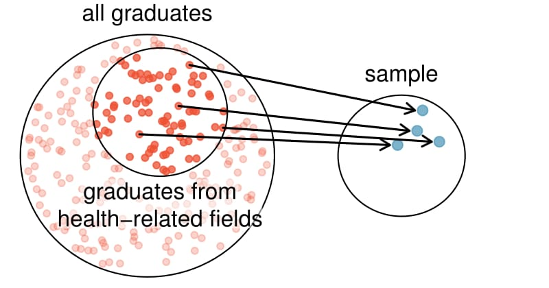
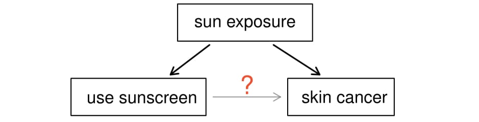

You know what variables you want to use, and you've looked over the codebook enough now that you have an idea of some potential data issues that you will have to address. 

Here are some questions for you to think about in preparation for doing data management on your own set of variables. 

Answer the following questions in prepartion to learn how to tackle problems such as missing data and recoding variables in the next week. Some of these items guide you to updating your personal codebook. For each variable that you have to modify, write a note in your codebook what you plan to do and why. You will include these notes into your data management script file as a record of your changes. 


1. **Do you understand what each variable is actually measuring?**
* In your codebook, give labels to All your variables. This includes adding in a note for each variable identifying if it is Quantitative or Categorical, and Level of Measurement (i.e., Nominal, Ordinal, Interval, and Ratio).
* Does your SPC recognize these variables as such: If not, note down that you'll have to change this later. 


2. **Do you need to code out missing data?**
* Go through your codebook for each variable and treat ALL variables for missing data. If there are no missing values then write that. 


3. **Are you going to only look at a subset of individuals?**
* What value of which variable specifically are you going to filter on? 


4. **Do you need to code out skip patterns?**
Are you looking at questions that only pertain to a specific subpopulation? (i.e. number of packs smoked per week only applies to smokers). Responses to the # of packs question should be set to missing for non-smokers. 


5. **Do you need to make response codes more logical?**
Some examples include:  

* Think about how the “yes” and “no” variables are coded   
    - Does NO = 0 and YES = 1?  
* Think about how the “strongly agree” to “strongly disagree” variables are coded
    - Do the numbers make sense?  
* Consider recoding a quantitative variable into a categorical variable  
* Consider collapsing across categories 
    - maybe going from 5 categories for strongly agree, agree, neutral, disagree, strongly disagree to 3 categories that represent strongly agree and agree as one category, disagree and strongly disagree as another, then neutral still in the middle.   
* Consider collapsing a quantitative variable into categories based on percentages of the data you find after examining the frequency table. 
    - (i.e. BMI: <16: underweight, 16-18.5 normal, 18.5-25 overweight, 30+ obese)
 


6. **Do you need to create secondary variables?**
If necessary, create secondary variables from continuous variables. If you are working with a number of items that represent a single construct, it may be useful to create a composite variable/score. 
    - For example, I want to use a list of nicotine dependence symptoms meant to address the presence or absence of nicotine dependence (i.e., tolerance, withdrawal, craving, etc.). Rather than using a dichotomous variable (i.e., nicotine dependence present/absent), I want to examine the construct as a dimensional scale (i.e., number of nicotine dependence symptoms). In this case, I would want to recode each symptom variable so that YES = 1 and NO = 0 and then sum the items so that they represent one composite score. In the code below, the nd_sum is the new variable I am creating and the variables after of are the variables I am totaling up.
    - nd_sum=sum (of nd_symptom1 nd_symptom2 nd_symptom3 nd_symptom4); (_SAS_)
* Don't forget when creating secondary variables, you need to visually check your new variables to ensure what you thought you did actually did what you wanted to.


<!--chapter:end:dm_prep_qs.Rmd-->

---
title: 'Lec 00: '
date: "Last Updated `r Sys.time()`"
output:
  html_document:
    highlight: tango
    theme: flatly
    toc: yes
    toc_float: yes
css: ../css/customh5.css
---

<!--chapter:end:lec00_blank.Rmd-->

---
title: "Introduction to MATH 615"
date: "Last Updated `r Sys.time()`"
output:
  html_document:
    highlight: tango
    theme: flatly
    toc: yes
    toc_float: yes
css: ../css/customh5.css
---

# Navigating course resources
* My website: http://norcalbiostat.com
    - First stop for all class materials
    - Links to individual classes, but shared resources on programming and data. 
* This class website https://norcalbiostat.github.io/MATH615/ 
    - Landing page for announcements
    - Details on weekly topics can be found on the schedule
    - Includes links to notes and additional materials
    - Sometimes links will not make it to all places (schedule/weekly overview/notes).
* Often links will be broken. Typo's happen. Notify me immediately and I'll get to it asap. 
* Both are mobile friendly to different extents. 
* The syllabus covers course details such as grading, office hours and required materials. 
* Blackboard Learn (BBL) used for discussion boards, blogging, and assignment submission. 
* Textbook used for data, reading and learning content. Sometimes problem sets. 


# Descriptive vs. Inferential Statistics
* [Passion Driven Statistics](PDS_Intro_Stat.pdf)
* Google `data analysis lifecycle` and look at images. What sense do you get? 


# Computing and Reproducibility
* Review these [Slides](http://benmarwick.github.io/UW-eScience-reproducibility-social-sciences/#/) on reproducible research in the social sciences.
    - I will not require any measure of version control or open source coding in this class. 
    - However nearly 80% of my work is available online. 
    - Big push for open research in the Natural Sciences. 
* Be mindful about file naming conventions (slide 11). Make a plan and stick with it. 
    * https://www.xkcd.com/1459/
* Expect to bring your laptop every day to class. 
    - The more reading and content learning done outside of class, the more time for in class analysis and discussion
    

# Analysis software choices    
* I will not dictate which software program you use in this class. 
* All my lecture notes use R. This entire website is built with R. That does not mean you must use R. 


## R
* Free. 
* Coding from day 1. Harder up front, more powerful in the end. 
* Seamless integration with a multitude of other scientific analysis and reporting mechanisms. 
* Google `tidyverse` images. Compare it to the images of the data analysis life cycle. What sense do you get? 
* My [instructions](https://norcalbiostat.netlify.com/post/software-overview/) on how to get setup.
* On campus resources
    - Introduction to R (MATH 130) 1 unit CR/NC
    - Data Science Initiative workshops, talks, open drop in analysis time. 
* Off Campus resources (a few)
    - Chico R Users Group 
        - [Meetup](https://www.meetup.com/Chico-R-Users-Group/)
        - [Google l-serv](https://groups.google.com/forum/#!forum/chico-rug)
    - [Data camp](http://www.datacamp.com)
    - [Quick-R](http://www.statmethods.net/)
    - [Cookbook for R](http://www.cookbook-r.com/)
    - [R Examples Repository](http://dwoll.de/rexrepos/) (This site was also built using R Markdown, is open source and a fabulous example of reproducible research!)
   
   
## SPSS
* [Purchase v23 or v24](http://www-03.ibm.com/software/products/en/spss-stats-gradpack) for $50 for 6mo rental. 
* Point and click, but can save code and write scripts. 
* Stand alone program. No integration. 
* Will be used again in NSFC 600 (no exp necc for that class either)
* On campus resources: From the desk of David Philhour (BSS) 
    - Open computer labs in Butte Hall (207, 211) with many open lab hours.
    - Tutoring center in AJH108 run by Dr. Penelope Kuhn. 
    - The psyc depth lab is Modoc 224 but is pretty impacted with classes Monday thru Thursday. Friday's are pretty open.
* Off Campus resources
    - Recommended [YouTube videos](https://www.youtube.com/results?search_query=andy+field+spss+tutorials) 
    - [UCLA IDRE PMA5 textbook examples](https://stats.idre.ucla.edu/other/examples/pma5/)

## SAS? STATA?
* If you have a burning desire to sure. I'm proficient in both. 
* AFAIK SAS is only now working on literate and integrated programming by using Jupyter notebooks and SAS University Edition (free)
* UCLA IDRE also has PMA5 textbook examples. 

# Going Public
* You're going to be doing an analysis on a public data set. 
* We're talking reproducibility and open source, let's put theory to practice. 
* You will "publicly" share your analysis steps and thought process. 
    - "Public" is in quotes because it will only be public to our class using Blackboard Learn
    - For those gung-ho R users I *highly* recommend building your blog using [`blogdown`](https://bookdown.org/yihui/blogdown/). 
        - This is the [tutorial](https://apreshill.rbind.io/post/up-and-running-with-blogdown/) that I used to get going.
        - Easy for even a moderate experienced R user to do. I can help you with setup if you need.


## Blogging in Academica

Taken directly from the `blogdown` documentation by Yihui Xie: 

> In the summer of 2012, I did my internship at the AT&T Labs Research,1 where I attended a talk given by Carlos Scheidegger (https://cscheid.net), and Carlos said something along the lines “if you don’t have a website nowadays, you don’t exist.” Later I paraphrased it as:

> “I web, therefore I am a spiderman.”

> Carlos’s words resonated very well with me, although they were a little exaggerative. A well designed and maintained website can be extremely helpful for other people to know you, and you do not need to wait for suitable chances at conferences or other occasions to introduce yourself in person to other people. On the other hand, a website is also highly useful for yourself to keep track of what you have done and thought. Sometimes you may go back to a certain old post of yours to relearn the tricks or methods you once mastered in the past but have forgotten.


Here are some other recently googled blog posts about why academics (and grad students) should blog  

* http://www.teaching-matters-blog.ed.ac.uk/?p=1685
* http://www.megankatenelson.com/4-reasons-blogs-are-great-for-academia/
* https://www.timeshighereducation.com/blog/seven-reasons-why-blogging-can-make-you-better-academic-writer


<!--chapter:end:lec01_intro_class.Rmd-->

---
title: 'Lec 03: Data screening'
date: "Last Updated `r Sys.time()`"
output:
  html_document:
    highlight: tango
    theme: flatly
    toc: yes
    toc_float: yes
css: ../css/customh5.css
---

```{r load2,echo=FALSE, warning=FALSE, message=FALSE}
library(knitr)
#library(rmarkdown)
opts_chunk$set(warning=FALSE, message=FALSE) 
```

# Data screening and transformations (_PMA5 Ch 4_)
Recall the aim of data preparation, screening, wrangling, or transforming is to 

* Identify outliers and inconsistent values
* Assess normality of the distribution
* Explore data transformations to aid description, inference. 


## Load data
Load in your cleaned depression data set. 
```{r}
depress <- read.table("~/GitHub/website/static/data/Depress_081217.txt", 
                      sep="\t", header=TRUE) 
```

## Describe the distribution of income
Be sure to write out your description in paragraph form and discuss the location (measures of center), spread (measures of variance) and shape (normality or skewness) of the distribution using an appropriate plot and summary statistics as evidence. Connect your text to specific features of the plot and/or summary statistics, do not just say "as you can see in the plot...". Make sure the plot is fully annotated with an appropriate title and axes labels. 

```{r}
hist(depress$income, prob=TRUE, xlab="Annual income (in thousands)", 
     main="Histogram and Density curve of Income", ylab="")
lines(density(depress$income), col="blue")
summary(depress$income)
```

The distribution of annual income is slightly skewed right with a mean of $20.5k per year and a median of $15k per year income. The range of values goes from $2k to $65k. Reported income above $40k appear to have been rounded to the nearest  $10k, because there are noticeable peaks at $40k, $50k, and $60k. 

In general, transformations are more effective when the the standard deviation is large relative to the mean. One rule of thumb is if the sd/mean ratio is less than 1/4, a transformation may not be necessary. 
```{r}
sd(depress$income) / mean(depress$income)
```

Alternatively Hoaglin, Mosteller and Tukey (1985) showed that if the largest observation divided by the smallest observation is over 2, then the data may not be sufficiently variable for the transformation to be decisive. 
```{r}
max(depress$income) / (min(depress$income)+.1)
```

Note these rules are not meaningful for data without a natural zero. The book goes into more detail about options for interval data. 


## Assessing Normality
Another common method of assessing normality is to create a normal probability (or normal quantile) plot. 
```{r}
qqnorm(depress$income);qqline(depress$income, col="red")
```

The points on the normal probability plot do not follow the red reference line very well. The dots show a more curved, or `U` shaped form rather than following a linear line. This is another indication that the data is skewed and a transformation for normality should be created. 

# Transformations

## Taking logs 
Create three new variables: `log10inc` as the log base 10 of Income, `loginc` as the natural log of Income, and `xincome` which is equal to the negative of one divided by the cubic root of income. 

```{r}
log10inc <- log10(depress$income)
loginc   <- log(depress$income)
xincome  <- -1/(depress$income)^(-1/3)
```


Create a single plot that display normal probability plots for the original, and each of the three transformations of income. Here I use the base graphics grid organizer `par(mfrow=c(r,c))` where `r` is the number of rows and `c` is the number of columns to show these plots side by side.

```{r, fig.width=10, fig.height=10}
par(mfrow=c(2,2)) # Try (4,1) and (1,4) to see how this works. 
qqnorm(depress$income, main="Income"); qqline(depress$income,col="blue")
qqnorm(log10inc, main="Log 10"); qqline(log10inc, col="blue")
qqnorm(loginc, main = "Natural Log"); qqline(loginc, col="blue")
qqnorm(xincome, main="-1/cuberoot(income)"); qqline(xincome, col="blue")
```

Which transformation does a better job of normalizing the distribution of Income?
 
## logs of zero values
Take the logarithm of the CESD score plus 1 and compare the histograms of CESD and log(CESD+1). Describe the distribution of each. 
```{r}
par(mfrow=c(2,1))
hist(log(depress$cesd+1))
hist(depress$cesd)
```

Question: Why was the +1 added to CESD prior to taking the log?


Consider the variable `AGESMOKE`. This represents the age in years when the respondent started smoking. If the respondent did not start smoking, `AGESMOKE` was assigned to a value of zero.

Question: Would we need to recode this variable during our data preparation stage? Why or why not? 

 
# Session Info
This document was compiled on `r Sys.time()` and with the following system information:
```{r}
sessionInfo()
```

<!--chapter:end:lec03_data_screen.Rmd-->

---
title: 'Lec 04: Categorical Data Analysis'
date: "Last Updated `r Sys.time()`"
output:
  pdf_document:
    toc: yes
  html_document:
    highlight: tango
    theme: flatly
    toc: yes
    toc_float: yes
css: ../css/customh5.css
---

```{r,echo=FALSE, warning=FALSE, message=FALSE}
library(knitr); library(rmarkdown); library(dplyr)
library(xtable)
opts_chunk$set(warning=FALSE, message=FALSE) 
```


#### Spam Data
This set of lecture notes uses data on incoming emails for the first three months of 2012 for David Diez’s (An Open Intro Statistics Textbook author) Gmail Account, early months of 2012. All personally identifiable information has been removed.

```{r}
email <- read.delim("https://norcalbiostat.netlify.com/data/email.txt", header=TRUE, sep="\t")
email <- email %>% mutate(hasnum = ifelse(number %in% c("big", "small"), 1, 0))
```

Two categorical variables of current interest are

* `spam` (0/1 binary indicator if a an email is flagged as spam). Converted into a Ham/Spam factor variable. 
* `number` categorical variable describing the size of the numbers contained in the email.  
    - `none`: No numbers 
    - `small`: Only values under 1 million
    - `big`: A value of 1 million or more
* `hasnum`: 0/1 binary indicator for if the email contains any sized number


#### Chi-Squared Distribution
Much of categorical data analysis uses the $\chi^{2}$ distribution. 

```{r, echo=FALSE, fig.align='center', fig.height=5, fig.width=5}
x <- seq(0,10, by=.01)
df <- c(1,2,3,4,6,8)
plot(c(0,10), c(0,1), type="n", xlab="x", ylab="P(X=x)", axes=FALSE, 
     main="Chi-Squared PDF")
for(k in df){
  lines(x, dchisq(x, k), col=k)
}
legend("topright", col=df, lty=1, legend=df, ncol=2, title="df")
axis(1); axis(2, las=2); box()
```

* The shape is controlled by a degrees of freedom parameter (df)
* Is used in many statistical tests for categorical data. 
* Is always positive (it's squared!)
    - High numbers result in low p-values
* Mathematically connected to many other distributions
    * Special case of the gamma distribution (One of the most commonly used 
      statistical distributions)
    * The sample variance has a $\chi^{2}_{n-1}$ distribution.  
    * The sum of $k$ independent standard normal distributions has a $\chi^{2}_{k}$ distribution. 
    * The ANOVA F-statistic is the ratio of two $\chi^{2}$ distributions divided by 
      their respective degrees of freedom. 


# Difference of two proportions

Now let's consider comparisons of proportions in two independent samples. 

**Ex**: Comparison of proportions of head injuries sustained in auto 
accidents by passengers wearing seat belts to those not wearing seat belts. 
You may have already guessed the form of the estimate: $\hat{p}_1 - \hat{p}_2$.

We are not going to go in depth into the calculations for the test statistic 
for a test of the difference in proportions. The OpenIntro textbook explains 
the assumptions and equations very well. Instead we are going to see how to 
use R to perform these calculations for us. 

Since the sample proportion can be calculated as the mean of a binary 
indicator variable, we can use the same `t.test` function in R
to conduct a hypothesis test and create a confidence interval.

### Example 1: Do numbers in emails affect rate of spam? (Case level data) 
If we look at the rate of spam for emails with and without numbers, 
we see that 6% of emails with numbers are flagged as spam compared to 
27% of emails without numbers are flagged as spam. 

```{r}
email %>% group_by(hasnum) %>% summarize(p.spam=round(mean(spam),2))
```

This is such a large difference that we don't really _need_ a statistical
test to tell us that this difference is significant. 
But we will do so anyhow for examples sake. 

1. **State the research question:** Are emails that contain numbers more likely to be spam? 
2. **Define your parameters:**   
Let $p_{nonum}$ be the proportion of emails _without_ numbers that are flagged as spam.  
Let $p_{hasnum}$ be the proportion of emails _with_ numbers that are flagged as spam.  

3. **Set up your statistical hypothesis:**  
$H_{0}: p_{nonum} = p_{hasnum}$   
$H_{A}: p_{nonum} \neq p_{hasnum}$ 

4. **Check assumptions:** Use the pooled proportion $\hat{p}$ to check the success-failure
condition. 
```{r}
p.hat <- mean(email$spam)
p.hat
```

* $\hat{p}*n_{nonum}$ = `p.hat * sum(email$hasnum==0)` = `r p.hat * sum(email$hasnum==0)`
* $\hat{p}*n_{hasnum}$ = `p.hat * sum(email$hasnum==1)` = `r p.hat * sum(email$hasnum==1)`
* $(1-\hat{p})*n_{nonum}$ = `(1-p.hat)* sum(email$hasnum==0)` = `r (1-p.hat)* sum(email$hasnum==0)`
* $(1-\hat{p})*n_{hasnum}$ = `(1-p.hat)* sum(email$hasnum==1)` = `r (1-p.hat) * sum(email$hasnum==1)`

The success-failure condition is satisfied since all values are at least 10, and we can
safely apply the normal model.

5. **Test the hypothesis** by calculating a test statistic and corresponding p-value. 
   Interpret the results in context of the problem. 
```{r}
t.test(spam~hasnum, data=email)
```

Significantly more emails with numbers were flagged as spam compared to emails
without numbers (27.1% versus 6.4% , p<.0001). 

### Example 2: Are mammograms helpful? (Summary numbers only)

Test whether there was a difference in breast cancer deaths in the mammogram 
and control groups. By entering in $x$ and $n$ as vectors we can test 
equivalence of these two proportions. The assumptions for using the normal model 
for this test have been discussed in detail in the textbook. 

```{r}
prop.test(x=c(500, 505), n=c(44925, 44910))
```

The interval for the difference in proportions covers zero and the p-value
for the test is 0.894, therefore the proportion of deaths due to breast 
cancer are equal in both groups. There is no indication from this data
that mammograms in addition to regular breast cancer screening, change
the risk of death compared to just the regular screening exams alone. 


# Contingency tables

* Both the explanatory and the response variables are categorical (Nominal or Ordinal)
* Tables representing all combinations of levels of explanatory and response variables
* A.k.a Two-way tables or _cross-tabs_
* Numbers in table represent Counts of the number of cases in each cell

```{r}
tab <- table(email$spam, email$number)
tab
```

# Tests of Association

There are three main tests of association for $rxc$ contingency table. 

* Test of Goodness of Fit
* Tests of Independence
* Test of Homogeneity

**Notation**

* $r$ is the number of rows and indexed by $i$
* $c$ is the number of columns and indexed by $j$. 

<br></br>


## Goodness of Fit

* OpenIntro Statistics: Chapter 6.3
* Tests whether a set of multinomial counts is distributed according to a 
  theoretical set of population proportions.
* Does a set of categorical data come from a claimed distribution? 
* Are the observed frequencies consistent with theory? 

$H_{0}$: The data come from the claimed discrete distribution  
$H_{A}$: The data to not come from the claimed discrete distribution. 

<br></br>

## Test of Independence

* OpenIntro Statistics: Chapter 6.4
* Determine whether two categorical variables are associated 
  with one another in the population
      - Ex. Race and smoking, or education level and political affiliation. 
* Data are collected at random from a population and the two 
  categorical variables are observed on each unit. 

$H_{0}: p_{ij} = p_{i.}p_{.j}$   
$H_{A}: p_{ij} \neq p_{i.}p_{.j}$ 

<br></br>

## Test of Homogeneity

* A test of homogeneity tests whether two (or more) sets of multinomial 
  counts come from different sets of population proportions.
* Does two or more sub-groups of a population share the same distribution
  of a single categorical variable?
    - Ex: Do people of different races have the same proportion of smokers?
    - Ex: Do different education levels have different proportions of 
      Democrats, Republicans, and Independents?
* Data on one characteristic is collected from randomly sampling 
  individuals within each subroup of the second characteristic. 

$H_{0}:$ 

$$p_{11} = p_{12} = \ldots = p_{1c}$$
$$p_{21} = p_{22} = \ldots = p_{2c}$$
$$\qquad \vdots $$
$$ p_{r1} = p_{r2} = \ldots = p_{rc}$$


$H_{A}:$ At least one of the above statements is false. 


<br></br>


All three tests use the **Pearsons' Chi-Square** test statistic. 

<br></br>

## Pearsons' Chi-Square
The chi-squared test statistic is the sum of the squared differences 
between the observed and expected values, divided by the expected value. 

### One way table
$$\chi^{2} = \sum^{r}_{i=1} \frac{(O_{i}-E_{i})^2}{E_{i}}$$

* $O_{i}$ observed number of type $i$
* $E_{i}$ expected number of type $i$. Equal to $Np_{i}$ under the null hypothesis
* N is the total sample size
* df = r-1

### Two way tables
$$\chi^{2} = \sum^{r}_{i=1}\sum^{c}_{j=1} \frac{(O_{ij}-E_{ij})^2}{E_{ij}}$$

* $O_{ij}$ observed number in cell $ij$
* $E_{ij} = Np_{i.}p_{.j}$ under the null hypothesis
* N is the total sample size
* df = (r-1)(c-1)

<br></br>


### Conducting these tests in R. 
* Test of equal or given proportions using `prop.test()`
```{r}
prop.test(table(email$number, email$spam))
```

* Chi-squared contingency table tests and goodness-of-fit tests using `chisq.test()`.  
This function can take raw data as input
```{r}
chisq.test(email$number, email$spam)
```
or a table object.
```{r}
chisq.test(tab)
```

### prop.test vs chisq.test()
```{r}
pt.out <- prop.test(table(email$number, email$spam))
cs.out <- chisq.test(tab)
```

* Same calculated test statistic and p-value
```{r}
c(pt.out$statistic, pt.out$p.value)
c(cs.out$statistic, cs.out$p.value)
```
* `prop.test` 
    - has a similar output appearance to other hypothesis tests 
    - shows sample proportions of outcome within each group
* `chisq.test`
    - stores the matricies of $O_{ij}$, $E_{ij}$, the residuals and standardized residuals

```{r}
cs.out$expected
```

### Mosaicplots

* The Pearson $\chi^{2}$ test statistic = Sum of squared residuals. 
* A shaded mosaicplot shows the magnitude of the residuals. 
    * Blue (positive residuals) = More frequent than expected
    * Red (negative residuals) = Less frequent than expected. 

```{r}
mosaicplot(tab, shade=TRUE, main="Association of spam status and number size in emails")
```

There are more spam emails with no numbers, fewer Ham emails with no numbers, 
and fewer spam emails with small numbers than would be expected
if these factors were independent. 
  
* More information on mosaicplots - http://www.datavis.ca/online/mosaics/about.html


# Assumptions and Extensions

* Simple random sample
* Adequate expected cell counts
    - At least 5 in all cells of a 2x2, or at least 80% of cells in a larger table.
    - NO cells with 0 cell count
* Observations are independent

If one or more of these assumptions are not satisfied, other methods
may still be useful. 

* McNemar’s Test for paired or correlated data
* Fishers exact test for when cell sizes are small (<5-10)
* Inter-rater reliability: Concordant and Discordant Pairs


<!--chapter:end:lec04_cda.Rmd-->

---
title: 'Lec 04: Linear Regression Analysis'
date: "Last Updated `r Sys.time()`"
output:
  html_document:
    highlight: tango
    theme: flatly
    toc: yes
    toc_float: yes
  pdf_document:
    toc: yes
css: ../css/customh5.css
---

```{r,echo=FALSE, warning=FALSE, message=FALSE}
library(knitr); library(rmarkdown);
opts_chunk$set(warning=FALSE, message=FALSE) 
```

# Assigned Reading
PMA5: Chapters 6-7

# Simple Regression and Correlation (_PMA5 Ch 6_)

## Aims
* Describe the relationship between an independent variable X and a continuous
  dependent variable $Y$ as a straight line. The textbook discusses two cases: 
    - Fixed-$X$: values of $X$ are preselected by investigator
    - Variable-$X$: have random sample of $(X,Y)$ values
    - Calculations are the same, 
* Draw inferences regarding this relationship
* Predict value of $Y$ for a given value of $X$

## Mathmatical Model
* The mean of $Y$ values at any given $X$ is $\beta_{0} + \beta_{1} X$
* The variance of $Y$ values at any $X$ is $\sigma^2$ (same for all X)
* $Y$ values are normally distributed at any given $X$ (need for inference)


## Parameter Estimates
* Estimate the slope $\beta_{1}$ and intercept $\beta_{0}$ using least-squares methods.
* The residual mean squared error (RMSE) is an estimate of the variance $s^{2}$
* Typically interested in inference on $\beta_{1}$
    - Assume no relationship between $X$ and $Y$ $(H_{0}: \beta_{1}=0)$ 
      until there is reason to believe there is one 
      $(H_{0}: \beta_{1} \neq 0)$

## Interval estimation
* Everything is estimated with some degree of error
* Confidence intervals for the mean of $Y$
* Prediction intervals for an individual $Y$ 

Which one is wider? Why?

## Corelation Coefficient
* The correlation coefficient $\rho$ measures the strength of association
  between $X$ and $Y$ in the _population_.
* $\sigma^{2} = VAR(Y|X)$ is the variance of $Y$ for a specific $X$.
* $\sigma_{y}^{2} = VAR(Y)$ is the variance of $Y$ for all $X$'s.

$$ \sigma^{2} = \sigma_{y}^{2}(1-\rho^{2})$$
$$ \rho^{2} = \frac{\sigma_{y}^{2} - \sigma^{2}}{\sigma_{y}^{2}}$$

* $\rho^{2}$ = reduction in variance of Y associated with knowledge of X/original variance of Y
* **Coefficient of Determiniation**: $100\rho^{2}$ = % of variance of Y associated with X or explained by X
* Caution: association vs. causation.

### Example: Lung Function

_Section 6.3_
1. Read in the analysis data set for the lung function. 
```{r}
fev <- read.delim("https://norcalbiostat.netlify.com/data/Lung_081217.txt", sep="\t", header=TRUE)
```

2. Create a scatterplot of FEV versus height for fathers. 
   Add a blue linear regression line and red lowess line.
   Add appropriate plot titles and axes labels.
   [R Cookbook reference](http://www.cookbook-r.com/Graphs/Scatterplots_(ggplot2)/)

```{r}
library(ggplot2)
qplot(y=FFEV1, x=FHEIGHT, geom="point", data=fev, xlab="Height", ylab="FEV1", 
      main="Scatter Diagram with Regression (blue) and Lowess (red) Lines 
      of FEV1 Versus Height for Fathers.") + 
      geom_smooth(method="lm", se=FALSE, col="blue") + 
      geom_smooth(se=FALSE, col="red") 
```

There does appear to be a tendency for taller men to have higher FEV1. 

3. Fit a linear model and report the regression parameter estimates. 
```{r}
model <- lm(FFEV1 ~ FHEIGHT, data=fev)
summary(model)
```
The least squares equation is $Y = -4.087 + 0.118X$.

4. Test for a significant relationship between height and FEV. Include a p-value and 
a confidence interval for the parameter estimate in your conclusion. 
```{r}
confint(model)
```
For ever inch taller a father is, his FEV1 measurement significantly increases by .12 (95%CI: .09, .15, p<.0001).  
The correlation between FEV1 and height is $\sqrt{.2544}$ = 0.5. 


## Assumptions of Linear Regression
* Homogeneity of variance (same $\sigma^{2}$)
    - Not extremely serious
    - Can use transformations to achieve it
    - Graphical assessment: Plot the residuals against the x variable, add a lowess line. 
      This assumption is upheld if there is no relationship/trend between the residuals and
      the predictor. 
```{r}
plot(model$residuals ~ fev$FHEIGHT)
lines(lowess(model$residuals ~ fev$FHEIGHT), col="red")
```

* Normal residuals
    - Slight departures OK
    - Can use transformations to achieve it
    - Graphical assessment: normal qqplot of the model residuals. 
```{r}
qqnorm(model$residuals)
qqline(model$residuals, col="red")
```
    
* Randomness / Independence
    - Very serious
    - Can use hierarchical models for clustered samples
    - No real good way to "test" for independence. Need to know how the sample was obtained. 
    
* Linear relationship
    - Slight departures OK
    - Can use transformations to achieve it
    - Graphical assessment: Simple scatterplot of $y$ vs $x$. 
      Looking for linearity in the relationship. 
      Should be done prior to any analysis. 
```{r}
plot(fev$FFEV1 ~ fev$FHEIGHT)
lines(lowess(fev$FFEV1 ~ fev$FHEIGH), col="red")
```


Some of these plots can be displayed by simply plotting the model
output. The advantage of this is that the observations that are
potential outliers are labeled with their row number.
```{r, fig.height=8, fig.width=8}
par(mfrow=c(2,2))
plot(model)
```


## What to watch out for
* Representative sample 
* Range of prediction should match observed range of X in sample
* Use of nominal or ordinal, rather than interval or ratio data
* Errors-in-variables
* Correlation does not imply causation 
* Violation of assumptions
* Influential points
* Appropriate model


The book goes into more detail about influential points, and how
outliers can have different affects on the model results depending
on if they are an outlier in $Y$ vs an outlier in $X$ (or both). 

<!--chapter:end:lec05_LinReg.Rmd-->

---
title: "Study Design"
author: "Robin Donatello"
date: "Last Updated `r Sys.time()`"
output:
  pdf_document:
    toc: yes
  html_document:
    highlight: tango
    theme: flatly
    toc: yes
    toc_float: yes
css: ../css/customh5.css
---
```{r,echo=FALSE, warning=FALSE, message=FALSE}
library(knitr); library(rmarkdown);library(ggplot2)
opts_chunk$set(warning=FALSE, message=FALSE, fig.height=4, fig.width=5) 
```


The first step in conducting research is to identify topics or questions that are to be investigated. A clearly laid out research question is helpful in identifying what subjects or cases should be studied and what variables are important. It is also important to consider how data are collected so that they are reliable and help achieve the research goals.


# Populations and samples

Recall that each research question is designed to make a statement or learn something about a target _population_. A _sample_ represents a subset of the cases and is often a small fraction of the population. 

Consider the following research question.

> What is the average mercury content in swordfish in the Atlantic Ocean?

The target population is all swordfish in the Atlantic Ocean, and each fish represents a case. Often times, it is too expensive to collect data for every case in a population. Instead, a sample is taken. For instance, 60 swordfish in the population might be selected, and this sample data may be used to provide an estimate of the population average and answer the research question.

For the following two questions, identify the target population, what a sample could consist of, and what represents an individual case.

> 1. Over the last 5 years, what is the average time to complete a degree for Chico State undergraduate students?
> 
> 2. Does a new drug reduce the number of deaths in patients with severe heart disease?


Next consider the following possible responses to the three research questions (RQ):

* A man on the news got mercury poisoning from eating swordfish, so the average mercury concentration in swordfish must be dangerously high.
* I met two students who took 10 years to graduate from Chico State, so it must take longer to graduate at Chico State than at other colleges.
* My friend's dad had a heart attack and died after they gave him a new heart disease drug, so the drug must not work.

Each conclusion is based on data. However, there are two problems. 

1. The data only represent one or two cases. 
2. It is unclear whether these cases are actually representative of the population.

Data collected in this haphazard fashion are called **anecdotal evidence**.

<span style="color:red">Such evidence may be true and verifiable, but it may only represent extraordinary cases.</span>


Anecdotal evidence typically is composed of unusual cases that we recall based on their striking characteristics. For instance, we are more likely to remember the two people we met who took 10 years to graduate than the 20 others who graduated in six years. Instead of looking at the most unusual cases, we should examine a sample of many cases that represent the population.


# Sampling from a population

Lets try to estimate the time to graduation for Chico State undergraduates in the last 5 years by collecting a sample of students. All graduates in the last 5 years represent the _population_, and graduates who are selected for review are collectively called the _sample_. In general, we always seek to _randomly_ select a sample from a population. 

The most basic type of random selection is equivalent to how raffles are conducted. For example, in selecting graduates, we could write each graduate's name on a raffle ticket and draw 100 tickets. The selected names would represent a random sample of 100 graduates.


Five graduates are randomly selected from the population to be included in the sample.


## Representation and Bias

Suppose we ask a student who happens to be majoring in nutrition to select several graduates for this study. What kind of students do you think she might collect? Do you think her sample would be representative of all graduates?

If someone was permitted to pick and choose exactly which graduates were included in the sample, it is entirely possible that the sample could be skewed to that person's interests, which may be entirely unintentional. This introduces **bias** into a sample. 


> A recent review of 74 studies of antidepressant agents found 38 studies with positive results and 36 studies with negative or questionable results. All but 1 of the 38 positive studies were published. Of the remaining 36, 22 were not published, and 11 were published in such a way as to convey a positive outcome. 

Describe how this selective reporting can have adverse consequences on health care.


### Simple Random Sampling

Sampling randomly helps resolve this problem. The most basic random sample is called a **simple random sample**, and which is equivalent to using a raffle to select cases. This means that each case in the population has an equal chance of being included and there is no implied connection between the cases in the sample.

Instead of sampling from all graduates equally, a nutrition major might inadvertently pick graduates with health-related majors disproportionately often. The act of taking a simple random sample helps minimize bias, however, bias can crop up in other ways.

 

Even when people are picked at random, e.g. for surveys, caution must be exercised if the **non-response** is high. For instance, if only 30% of the people randomly sampled for a survey actually respond, then it is unclear whether the results are _representative_ of the entire population. This **non-response bias** can skew results.

Due to the possibility of non-response, surveys studies may only reach a certain group within the population. It is difficult, and often times impossible, to completely fix this problem.


### Convienience Sample 

The next type of sampling to discuss is called a **convenience sample**. This is where individuals who are easily accessible are more likely to be included in the sample. For instance, if a political survey is done by stopping people walking in the Bronx, this will not represent all of New York City. It is often difficult to discern what sub-population a convenience sample represents.

> We can easily access ratings for products, sellers, and companies through websites. These ratings are based only on those people who go out of their way to provide a rating. If 50% of online reviews for a product are negative, do you think this means that 50% of buyers are dissatisfied with the product?

### Volunteer Sample (Opt-In)

In a volunteer sample, individuals choose to be included. In general, volunteer samples tend to be comprised of individuals who have a particularly strong opinion about an issue and are looking for an opportunity to voice it. 

> * A student posts a music-lovers' survey to campus announcements, asking people to vote for their favorite type of music.
> 
> * The Student Evaluations of Teaching (SET) that you have to fill out each semester for each teacher. 


<span style="color:red">**Such a sample is almost guaranteed to be biased.**</span>

Whether the responses obtained from such a sample are over- or under-estimated, and to what extent, cannot be determined. As a result, data obtained from a voluntary response sample is quite useless when you think about the "Big Picture", since the sampled individuals only provide information about themselves, and we cannot generalize to any larger group at all.

However, a volunteer sample is not so problematic for a study conducted for the purpose of comparing several treatments.

_In some cases volunteer samples are the only ethical way to obtain a sample. In medical studies, for example, in which new treatments are tested, subjects must choose to participate by signing a consent form that highlights the potential risks and benefits._ 

## Clustered Sampling

Cluster sampling is used when our population is naturally divided into groups (which we call clusters). 

* All the students in a university are divided into majors
* all the nurses in a certain city are divided into hospitals
* all registered voters are divided into precincts (election districts). 

In cluster sampling, we take a random sample of clusters, and use all the individuals within the selected clusters as our sample. 

> In order to get a sample of high school seniors from a certain city, you choose 3 high schools at random from among all the high schools in that city and use all the high school seniors in the three selected high schools as your sample.

> Ask your professors for email rosters of all the students in your classes. Randomly sample some addresses and email those students with your question about musical preference.

Here is a case where the sampling frame (list of potential individuals to be sampled) does not match the population of interest. 

* The population of interest consists of all students at the university, whereas the sampling frame consists of only your classmates. 
* There may be bias arising because of this discrepancy. 

> Students with similar majors will tend to take the same classes as you, and their musical preferences may also be somewhat different from those of the general population of students. 

It is always best to have the sampling frame match the population as closely as possible.


### Identifying problems with sampling strategies

A statistics student who is curious about the relationship between the amount of time students spend on social networking sites and their performance at school decides to conduct a survey. Three research strategies for collecting data are described below. In each, describe any potential problems and bias you might expect.

1. He randomly samples 40 students from the study's population, gives them the survey, asks them to fill it out and bring it back the next day.
2. He gives out the survey only to his friends, and makes sure each one of them fills out the survey.
3. He posts a link to an online survey on his Facebook wall and asks his friends to fill out the survey.


# Study Design 

There are two primary types of data collection: **observational** studies and **experiments**.

## Observational Study

The researcher simply monitors and collects data on things as they are. There is no manipulation of the study by the researcher. 

> * The Youth Risk Behavior Surveillance System (YRBSS) monitors six types of health-risk behaviors that contribute to the leading causes of death and disability among youth and adults.
> 
> * Measurements are taken on post-spawn carcasses of Chinook Salmon in Butte Creek to assess the annual population health.
> 
> * We collect a representative sample from the population of smokers who are just now trying to quit by using a nationwide telephone survey of 1,000 individuals. We ask them how they are trying to quit and classify it into one of four groups: 1) Drugs that alleviate nicotine addiction; 2) Therapy that trains smokers to quit; 3) A combination of drugs and therapy; or 4) Neither form of intervention (quitting "cold turkey"). One year later, we contact the same 1,000 individuals and determine whether they succeeded in quitting.


In general, observational studies can provide evidence of a naturally occurring association between variables, but **they cannot by themselves show a causal connection.**


## Experiment

In a controlled experiment, the researcher controls the value of the explanatory variable for each unit. In other words, the researcher controls which subjects go into which treatment groups. 

> * We may suspect that diet and exercise reduce mortality in heart attack patients over the following year. Researchers collect a sample of individuals who have recently experienced a heart attack and split them into groups. The individuals in each group are assigned a treatment, one group per level of the explanatory variable. Patients are followed over a year and record the number of deaths per group. 
> 
> * To study the effect of tar contained in cigarettes researchers (Wynder 1953) painted tobacco tar on the back of some mice but not others, and observed if the painted mice had cancer at a higher rate than those not exposed to the tar.
> 
> * We collect a representative sample from the population of smokers who are just now trying to quit by using a nationwide telephone survey of 1,000 individuals. We divide the sample into 4 groups of 250 and assign each group to use one of the four methods to quit. One year later, we contact the same 1,000 individuals and determine whose attempts at quitting succeeded while using our designated method.


The value of such control is that **cause-and-effect relationships can be established** between the response and explanatory variable.


# Confounding and Lurking variables

> Suppose an observational study tracked sunscreen use and skin cancer, and it was found that the more sunscreen someone used, the more likely the person was to have skin cancer. Does this mean sunscreen _causes_ skin cancer?

Some previous research tells us that using sunscreen actually reduces skin cancer risk, so maybe there is another variable that can explain this hypothetical association between sunscreen usage and skin cancer. One important piece of information that is absent is sun exposure. If someone is out in the sun all day, she is more likely to use sunscreen AND more likely to get skin cancer. Exposure to the sun is unaccounted for in the simple investigation.





Sun exposure is what is called a **confounding variable**,(a.k.a **lurking variable**, **confounder** or a **confounding factor**.) which is a variable that is correlated with both the explanatory and response variables. 

We could control for the lurking varible of sun exposure by collecting information on the individuals and categorizing their amount of sun exposure as *high* and *low* exposure, then we could run a stratified model to see if the relationship between sunscreen use and skin cancer is the same between each exposure group. 

* But then what if race/ethnicity tends to drive how much sun exposure they have? Or sunscreen use? It is easy to imagine that those with very light skin color will either tend to use suncreen more, or stay out of the sun more than those with a darker skin color 


While one method to justify making causal conclusions from observational studies is to exhaust the search for confounding variables, there is no guarantee that all confounding variables can be examined or measured. It is because of the existence of a virtually unlimited number of potential lurking variables that we can never be 100% certain of a claim of causation based on an observational study. 


Confounding is a major threat to the validity of inferences made about statistical associations. In the case of a confounding variable, the observed association with the response variable should be attributed to the confounder rather than the explanatory variable. We test for confounders by including these additional in our statistical models that may explain the association of interest. 

> In other words, we want to demonstrate that our association of interest is significant even after controlling for potential confounders. 

We do so by building a **Multivariable Model**. 


# Types of multivariable relationships

How can I keep them all separate? 


* The exposure works through the *mediator*
* The *confounder* affects both exposure and outcome
* The *moderator* changes the relationship between the exposure and the outcome. 
* Everything else is a *covariate*


<!--chapter:end:lec06_StudyDesign.Rmd-->

---
title: "Multiple Regression"
author: "Robin Donatello"
date: "Last Updated `r Sys.time()`"
output:
  pdf_document:
    toc: yes
  html_document:
    highlight: tango
    theme: flatly
    toc: yes
    toc_float: yes
urlcolor: blue
css: ../css/customh5.css
---
```{r,echo=FALSE, warning=FALSE, message=FALSE}
library(knitr); library(rmarkdown);library(ggplot2); library(gridExtra); 
library(pander)
opts_chunk$set(warning=FALSE, message=FALSE, fig.height=4, fig.width=5) 

fev <- read.delim("https://norcalbiostat.netlify.com/data/Lung_081217.txt", 
                    sep="\t", header=TRUE)
```


This topic is discussed in depth in PMA5, Chapter 7.
The UCLA IDRE has constructed [[textbook examples]](https://stats.idre.ucla.edu/spss/examples/pma5/practical-multivariate-analysis-fifth-edition-by-afifi-may-and-clarkchapter-7-multiple-regression-and-correlation/) for this chapter.

\newpage

# Purpose

The general purpose of multiple regression is to learn more about the relationship between several independent or predictor variables and a quantitative dependent variable. Multiple regression procedures are very widely used in research. In general, this inferential tool allows us to ask (and hopefully answer) the general question "_what is the best predictor of_...", and does “_additional variable A_” or “_additional variable B” confound the relationship between my explanatory and response variable?_” 

> * Educational researchers might want to learn about the best predictors of success in high-school. 
* Sociologists may want to find out which of the multiple social indicators best predict whether or not a new immigrant group will adapt to their new country of residence. 
* Biologists may want to find out which factors (i.e. temperature, barometric pressure, humidity, etc.) best predict caterpillar reproduction. 


Consider three variables that measure lung function: Age, Height, and FEV1 (The amount of air exhaled during the first second of a forced breath). 

```{r, fig.width=10}
a <- ggplot(fev, aes(y=FFEV1, x=FAGE)) + 
        geom_point() + geom_smooth(se=FALSE) + theme_bw()
b <- ggplot(fev, aes(y=FFEV1, x=FHEIGHT)) + 
        geom_point() + geom_smooth(se=FALSE) + theme_bw()
grid.arrange(a, b, ncol=2)
```


**Multiple Linear Regression**,

* Extends simple linear regression.
* Describes a linear relationship between a single continuous $Y$ variable, and several $X$ variables.
* Predicts $Y$ from $X_{1}, X_{2}, \ldots , X_{P}$.

Now it's no longer a 2D regression _line_, but a $p$ dimensional regression plane. 


## Types of X variables
* Fixed: The levels of $X$ are selected in advance with the intent to measure the affect on an outcome $Y$. 
* Variable: Random sample of individuals from the population is taken and $X$ and $Y$ are measured on each individual.
* X's can be continuous or discrete (categorical)
* X's can be transformations of other X's, e.g., $log(x), x^{2}$. 

## Mathematical Model

$$ y_{i} = \beta_{0} + \beta_{1}x_{1i} + \ldots + \beta_{p}x_{pi} + \epsilon_{i}$$

The assumptions on the residuals $\epsilon_{i}$ still hold:   

* They have mean zero  
* They are homoscedastic, that is all have the same finite variance: $Var(\epsilon_{i})=\sigma^{2}<\infty$  
* Distinct error terms are uncorrelated: (Independent) $\text{Cov}(\epsilon_{i},\epsilon_{j})=0,\forall i\neq j.$  

The regression model relates $y$ to a function of $\textbf{X}$ and $\mathbf{\beta}$, where $\textbf{X}$ is a $nxp$ matrix of $p$ covariates on $n$ observations and $\mathbf{\beta}$ is a length $p$ vector of regression coefficients.

In matrix notation this looks like: 

$$ \textbf{y} = \textbf{X} \mathbf{\beta} + \mathbf{\epsilon} $$

## Parameter Estimation
The goal of regression analysis is to minimize the residual error. 
That is, to minimize the difference between the value of the dependent
variable predicted by the model and the true value of the dependent variable.

$$ \epsilon_{i} = \hat{y_{i}} - y_{i}$$

The method of Least Squares accomplishes this by finding parameter estimates 
$\beta_{0}$ and $\beta_{1}$ that minimized the sum of the squared residuals:

$$ \sum_{i=1}^{n} \epsilon_{i} $$

For simple linear regression the regression coefficient estimates that minimize the sum of squared errors can be calculated as: 
$$ \hat{\beta_{0}} = \bar{y} - \hat{\beta_{1}}\bar{x} \quad \mbox{  and  } \quad  \hat{\beta_{1}} = r\frac{s_{y}}{s_{x}} $$

For multiple linear regression, the fitted values $\hat{y_{i}}$ are calculated as the linear combination of x's and $\beta$'s, $\sum_{i=1}^{p}X_{ij}\beta_{j}$. The sum of the squared residual errors (the distance between the observed point $y_{i}$ and the fitted value) now has the following form: 

$$ \sum_{i=1}^{n} |y_{i} - \sum_{i=1}^{p}X_{ij}\beta_{j}|^{2}$$

Or in matrix notation

$$ || \mathbf{y} - \mathbf{X}\mathbf{\beta} ||^{2} $$ 

The details of methods to calculate the Least Squares estimate of $\beta$'s is left to a course in mathematical statistics. 

## Continued Example: Lung Function

In PMA5 Chapter 6, the data for fathers from the lung function data set were analyzed. These data fit the variable-X case. Height was used as the $X$ variable in order to predict `FEV`. 

```{r}
fev.ht.model <- lm(FFEV1 ~ FHEIGHT , data=fev)
summary(fev.ht.model)
round(confint(fev.ht.model),2)
```

This model concludes that FEV1 in fathers significantly increases by 0.12 (95% CI:0.09, 0.15) liters per additional inch in height (p<.0001). Looking at the multiple $R^{2}$ (correlation of determination), this simple model explains 25% of the variance seen in the outcome $y$. 

However, FEV tends to decrease with age for adults, so we should be able to predict it better if we use both height and age as independent variables in a multiple regression equation. 

*  What direction do you expect the slope coefficient for age to be? For height? 

----

# Model fitting

## Simple Linear Regression
Let's examine the bivarate relationship of FEV1 (forced expiratory volume in 1 minute) for fathers `FFEV1` on their age `FAGE`. 

```{r}
fev1.age.model <- lm(FFEV1 ~ FAGE, data=fev)
summary(fev1.age.model)
confint(fev1.age.model)
```

For every one year older the father gets, his FEV1 significantly decreases by 0.03 (95% CI 0.02, 0.04) liters (p = .00001).

```{r}
fev1.ht.model <- lm(FFEV1 ~ FHEIGHT, data=fev)
summary(fev1.ht.model)
confint(fev1.ht.model)
```
For every inch taller a father is, his FEV1 significantly increases by 0.11 (95%CI 0.09, 0.15) liters (p < .0001).

## Multiple Linear Regression
Fitting a regression model in R with more than 1 predictor is trivial. Just add each variable to the right hand side of the model notation connected with a `+`. 

```{r}
mv_model <- lm(FFEV1 ~ FAGE + FHEIGHT, data=fev)
summary(mv_model)
confint(mv_model)
```
Holding height constant, a father who is one year older is expected to have a FEV value 0.03 (0.01, 0.04) liters less than another man (p<.0001).

Holding height constant, a father who is 1cm taller than another man is expected to have a FEV value of 0.11 (.08, 0.15) liter greater than the other man (p<.0001). 

For the model that includes age, the coefficient for height is now `r round(mv_model$coefficients[3],2)`, which is interpreted as the rate of change of FEV1 as a function of height **after adjusting for age**. This is also called the **partial regression coefficient** of FEV1 on height after adjusting for age. 

Both height and age are significantly associated with FEV in fathers (p<.0001 each).


## Model Diagnostics 

The same set of regression diagnostics can be examined to identify any potential influential points, outliers or other problems with the linear model. 

```{r}
par(mfrow=c(2,2))
plot(mv_model)
```


## Multicollinearity

* Occurs when some of the X variables are highly intercorrelated.
* Affects estimates and their SE's (p. 143)
* Look at tolerance, and its inverse, the Variance Inflation Factor (VIF)
* Need tolerance < 0.01, or VIF > 100.

```{r}
library(car)
vif(mv_model)
tolerance = 1/vif(mv_model)
tolerance
```

* Solution: use variable selection to delete some X variables.
* Alternatively, use Principal Components (PMA5 Ch. 14)

----


# Interlude: The necessity of tidy data for analysis. 

The data on Lung function originally was recorded in _wide_ format, with separate variables for mother's and father's FEV1 score (`MFEV1` and `FFEV`). In this format, the data is one record per family. 

```{r}
head(fev)
```

To analyze the effect of gender on FEV, the data need to be in _long_ format, with a single variable for `FEV` and a separate variable for gender. The following code chunk demonstrates one method of combining data on height, gender, age and FEV1 for both males and females. 

```{r}
fev2 <- data.frame(gender = c(fev$FSEX, fev$MSEX), 
                   FEV = c(fev$FFEV1, fev$MFEV1), 
                   ht = c(fev$FHEIGHT, fev$MHEIGHT), 
                   age = c(fev$FAGE, fev$MAGE))
fev2$gender <- factor(fev2$gender, labels=c("M", "F"))
head(fev2)  
```

The UCLA IDRE [[textbook examples]](https://stats.idre.ucla.edu/spss/examples/pma5/practical-multivariate-analysis-fifth-edition-by-afifi-may-and-clarkchapter-7-multiple-regression-and-correlation/) shows you how to reshape this data long to wide using `varstocases`. 

----

# Stratification & Interactions 

Recall when testing for a moderator, we fit models _stratified_ on the potential moderating variable. 
In doing so, we were examining the regression equations for each subgroup of the population and seeing if the relationship between the response and explanatory variables _changed_ for at least one subgroup. 

Consider the relationship between the length of an iris petal, and the length of it's sepal. Earlier we found that the iris species modified this relationship. Lets consider a binary indicator variable for species that groups _veriscolor_ and _virginica_ together. 

```{r}
iris$setosa <- ifelse(iris$Species=="setosa", 1, 0)
table(iris$setosa, iris$Species)
```

Within the _setosa_ species, there is little to no relationship between sepal and petal length. For the other two species, the relationship looks still significantly positive, but in the combined sample there appears to be a strong positive relationship (blue). 

```{r}
ggplot(iris, aes(x=Sepal.Length, y=Petal.Length, col=as.factor(setosa))) + 
            geom_point() + theme_bw() + theme(legend.position="top") + 
            scale_color_manual(name="Species setosa", values=c("red", "darkgreen")) + 
            geom_smooth(se=FALSE, method="lm") + 
            geom_smooth(aes(x=Sepal.Length, y=Petal.Length), col="blue", se=FALSE, method='lm')
```

The mathematical model describing the relationship between Petal length ($Y$), and Sepal length ($X$), for species _setosa_ ($s$) versus not-setosa ($n$), is written as follows: 

$$ Y_{is} \sim \beta_{0s} + \beta_{1s}*x_{i} + \epsilon_{is} \qquad \epsilon_{is} \sim \mathcal{N}(0,\sigma^{2}_{s})$$
$$ Y_{in} \sim \beta_{0n} + \beta_{1n}*x_{i} + \epsilon_{in} \qquad \epsilon_{in} \sim \mathcal{N}(0,\sigma^{2}_{n}) $$

In each model, the intercept, slope, and variance of the residuals can all be different. This is the unique and powerful feature of stratified models. The downside is that each model is only fit on the amount of data in that particular subset. Furthermore, each model has 3 parameters that need to be estimated: $\beta_{0}, \beta_{1}$, and $\sigma^{2}$, for a total of 6 for the two models. The more parameters that need to be estimated, the more data we need. 


## Simplififcation of interaction models {#simplify}

If we only care about how species changes the relationship between petal and sepal length, we can fit what is called an **interaction** model. Interactions are mathematically represented as a multiplication between the two variables that are interacting: here it is sepal length ($x_{1}$) and species ($x_{2}$). Note that both _main effects_ of sepal length, and species are also included in the model. 

$$ Y_{i} \sim \beta_{0} + \beta_{1}x_{i} + \beta_{2}x_{2i} + \beta_{3}x_{1i}x_{2i}$$

When $x_{2} = 0$, the record is on an iris not from the _setosa_ species. 

$$ Y_{i} \sim \beta_{0} + \beta_{1}x_{i} + \beta_{2}(0) + \beta_{3}x_{1i}(0)$$
which simplifies to 
$$ Y_{i} \sim \beta_{0} + \beta_{1}x_{i}$$

When $x_{2} = 1$, the record is on an iris of the _setosa_ species. 

$$ Y_{i} \sim \beta_{0} + \beta_{1}x_{i} + \beta_{2}(1) + \beta_{3}x_{1i}(1)$$
which simplifies to
$$ Y_{i} \sim (\beta_{0} + \beta_{2}) + (\beta_{1} + \beta_{3})x_{i}$$

These then **are** the stratified models! Each sub-model has a different intercept and slope, but we only had to estimate 4 parameters instead of 6. 


Interactions are fit in `R` by simply multiplying `*` the two variables together in the model statement. 
```{r}
summary(lm(Petal.Length ~ Sepal.Length + setosa + Sepal.Length*setosa, data=iris))
```

The coefficient $b_{3}$ for the interaction term is significant, confirming that species changes the relationship between sepal length and petal length. How we interpret this, and the other coefficients will be discussed later. 

## Adding more covariates to the model

What if we now wanted to include other predictors in the model? How does sepal length relate to petal length after controlling for petal width? We add the variable for petal width into the model

```{r}
summary(lm(Petal.Length ~ Sepal.Length + setosa + Sepal.Length*setosa + Petal.Width, data=iris))
```

So far, petal width, and the combination of species and sepal length are both significantly associated with petal length. 

_Note of caution: Stratification implies that the stratifying variable interacts with all other variables._ 
So if we were to go back to the stratified model where we fit the model of petal length on sepal length AND petal width, stratified by species, we would  be implying that species interacts with both sepal length and petal width. 

----


# Categorical Predictors

This topic is also discussed in more detail in PMA5 Chapter 9.3.


## Example: Iris species
Let's continue to model the length of the iris petal based on the length of the sepal, controlling for species. But here we'll keep species as a categorical variable. What happens if we just put the variable in the model? 

```{r}
summary(lm(Petal.Length ~ Sepal.Length + Species, data=iris))
```

Examine the coefficient names, `Speciesversicolor` and `Speciesvirginica`. R (and most software packages) automatically take a categorical variable and turn it into a series of binary indicator variables. Let's look at what the software program does in the background. Below is a sample of the iris data. The first column shows the row number, specifically I am only showing 2 sample rows from each species. The second column is the value of the sepal length, the third is the binary indicator for if the iris is from species _versicolor_, next the binary indicator for if the iris is from species _virginica_, and lastly the species as a 3 level categorical variable (which is what we're used to seeing at this point.)

```{r, echo=FALSE}
a <- model.matrix(Petal.Length ~ Sepal.Length + Species, data=iris)
b <- data.frame(a, Species=iris$Species)[c(1:2,51:52,101:102),-1]
pander(b)
```

## Factor variable coding

* Most commonly known as "Dummy coding". Not an informative term to use. 
* Better used term: Indicator variable
* Math notation: **I(gender == "Female")**. 
* A.k.a reference coding
* For a nominal X with K categories, define K indicator variables.
    - Choose a reference (referent) category:
    - Leave it out
    - Use remaining K-1 in the regression.
    - Often, the largest category is chosen as the reference category.

For the iris example, 2 indicator variables are created for _versicolor_ and _virginica_. Interpreting the regression coefficients are going to be **compared to the reference group**. In this case, it is species _setosa_. 

The mathematical model is now written as follows, where $x_{1}$ is Sepal Length, $x_{2}$ is the indicator for _versicolor_, and $x_{3}$ the indicator for _virginica_ 

$$ Y_{i} \sim \beta_{0} + \beta_{1}x_{i} + \beta_{2}x_{2i} + \beta_{3}x_{3i}+ \epsilon_{i}$$

Let's look at the regression coefficients and their 95% confidence intervals from the main effects model again. 

```{r}
main.eff.model <- lm(Petal.Length ~ Sepal.Length + Species, data=iris)
pander(main.eff.model)
pander(confint(main.eff.model))
```

In this _main effects_ model, Species only changes the intercept. The effect of species is not multiplied by Sepal length. The interpretations are the following: 

* $b_{1}$: After controlling for species, Petal length significantly increases with the length of the sepal (0.63, 95% CI 0.54-0.72, p<.0001). 
* $b_{2}$: _Versicolor_ has on average 2.2cm longer petal lengths compared to _setosa_ (95% CI 2.1-2.3, p<.0001). 
* $b_{3}$: _Virginica_ has on average 3.1cm longer petal lengths compared to _setosa_ (95% CI 2.9-3.3, p<.0001). 


# Interactions between Q*B and Q*C

Lastly let's look at how to fit and interpret a model with an interaction between a categorical and a continuous variable. Recall an interaction **changes the relationship** between an explanatory variable and the response variable. 


## Q*B

Let's revisit the interaction model where $x_{1}$ is Sepal Length and $x_{2}$ is the indicator for _setosa_. 

$$ Y_{i} \sim \beta_{0} + \beta_{1}x_{i} + \beta_{2}x_{2i} + \beta_{3}x_{1i}*x_{2i}$$
```{r}
summary(lm(Petal.Length ~ Sepal.Length + setosa + Sepal.Length*setosa, data=iris))
```

<span style="color:red"> The main effects ($b_{1}$, $b_{2}$) cannot be interpreted by themselves when there is an interaction in the model. </span>

* If $x_{2}=0$, then the effect of $x_{1}$ on $Y$ simplifies to: $\beta_{1}$
    * $b_{1}$ The effect of sepal length on petal length **for non-setosa species of iris** (`setosa=0`) 
    * For non-setosa species, the petal length increases 1.03cm for every additional cm of sepal length. 
* If $x_{2}=1$, then the effect of $x_{1}$ on $Y$ model simplifies to: $\beta_{1} + \beta_{3}$
    * For setosa species, the petal length increases by `1.03-0.9=0.13` cm for every additional cm of sepal length. 
 
Don't remember how I got these model simplifications? See this [section](#simplify)

## Q*C

Let's up the game now and look at the full interaction model with a categorical version of species. Recall $x_{1}$ is Sepal Length, $x_{2}$ is the indicator for _versicolor_, and $x_{3}$ the indicator for _virginica_ . 

$$ Y_{i} \sim \beta_{0} + \beta_{1}x_{i} + \beta_{2}x_{2i} + \beta_{3}x_{3i} + \beta_{4}x_{1i}x_{2i} + \beta_{5}x_{1i}x_{3i}+\epsilon_{i}$$
```{r}
summary(lm(Petal.Length ~ Sepal.Length + Species + Sepal.Length*Species, data=iris))
```

The slope of the relationship between sepal length and petal length is calculated as follows, for each species:   

* _setosa_ $(x_{2}=0, x_{3}=0): b_{1}=0.13$ 
* _versicolor_ $(x_{2}=1, x_{3}=0): b_{1} + b_{2} + b_{4} = 0.13+0.55 = 0.68$
* _virginica_ $(x_{2}=0, x_{3}=1): b_{1} + b_{3} + b_{5} = 0.13+0.62 = 0.75$

Compare this to the estimates gained from the stratified model: 

```{r}
coef(lm(Petal.Length ~ Sepal.Length, data=subset(iris, Species=="setosa")))
coef(lm(Petal.Length ~ Sepal.Length, data=subset(iris, Species=="versicolor")))
coef(lm(Petal.Length ~ Sepal.Length, data=subset(iris, Species=="virginica")))
```

They're the same! Proof that an interaction is equivelant to stratification. 

**So why do an interaction? Why not stratify?**

Stratification implies that the stratifying variable interacts with all other variables. Even variables that the variable is not directly interacting with. 

E.g. the stratified model below

* $Y = A + B + C + D + C*D$, when D=1
* $Y = A + B + C + D + C*D$, when D=0

is the same as the following interaction model: 

* $Y = A + B + C + D + A*D + B*D + C*D$


<!--chapter:end:lec07_MLR.Rmd-->

---
title: 'Logistic Regression'
author: "Robin Donatello"
date: "Last Updated `r Sys.time()`"
output:
  pdf_document:
    toc: yes
  html_document:
    highlight: tango
    theme: flatly
    toc: yes
    toc_float: yes
css: ../css/customh5.css
---
```{r,echo=FALSE, warning=FALSE, message=FALSE}
library(knitr); library(rmarkdown);
library(ggplot2); library(dplyr); 
library(xtable); library(pander)
options(xtable.comment = FALSE)
opts_chunk$set(warning=FALSE, message=FALSE) 
```


# References

## Assigned reading

* Open Intro Section 8.4
* PMA5 Ch 12 (selected)
* Article: When can odds ratios mislead? http://www.ncbi.nlm.nih.gov/pmc/articles/PMC1112884/

## Additional references
* Odds Ratios: http://www.ats.ucla.edu/stat/sas/faq/oratio.htm 
* Marin Stats Lecture on OR and RR: https://www.youtube.com/watch?v=V_YNPQoAyCc 


# Introduction

* Logistic regression is a tool used to model a categorical outcome variable with two levels: Y = 1 if event, = 0 if no event. 
* Instead of modeling the outcome directly $E(Y|X)$ as with linear regression, we model the probability of an event occurring: $P(Y=1|X)$. 

## Uses of Logistic Regression (PMA5 12.10)
* Assess the impact selected covariates have on the probability of an outcome occurring. 
* Predict the likelihood / chance / probability of an event occurring given a certain covariate pattern.  


# The Logistic Regression Model (PMA5 12.4)
Let $p_{i} = P(y_{i}=1)$. 

The logistic model relates the probability of an event based on a linear combination of X's. 

$$
log\left(
\frac{p_{i}}{1-p_{i}}
\right) = \beta_{0} + \beta_{1}x_{1i} + \beta_{2}x_{2i} + \ldots + \beta_{p}x_{pi}
$$

Since the _odds_ are defined as the probability an event occurs divided by the  probability it does not occur: $(p/(1-p))$, the function $log\left(\frac{p_{i}}{1-p_{i}}\right)$ is also known as the _log odds_, or more commonly called the **_logit_**. 

```{r, fig.width=4, fig.height=3}
p <- seq(0, 1, by=.01)
logit.p <- log(p/(1-p))
qplot(logit.p, p, geom="line", xlab = "logit(p)", main="The logit transformation")
```

This in essence takes a binary outcome 0/1 variable, turns it into a continuous probability (which only has a range from 0 to 1) Then the logit(p) has a continuous distribution ranging from $-\infty$ to $\infty$, which is the same form as a Multiple Linear Regression (continuous outcome modeled on a set of covariates)

## Modeling the probability of an event. 

Back solving the logistic model for $p_{i} = e^{\beta X} / (1+e^{\beta X})$: 

$$
p_{i} = \frac{e^{\beta_{0} + \beta_{1}x_{1i} + \beta_{2}x_{2i} + \ldots + \beta_{p}x_{pi}}}
{1 + e^{\beta_{0} + \beta_{1}x_{1i} + \beta_{2}x_{2i} + \ldots + \beta_{p}x_{pi}}}
$$

## Logistic Regression via GLM

A logistic regression model can be fit in R using the `glm()` function. GLM stands for _Generalized Linear Model_. GLM's can fit an entire _family_ of distributions and can be thought of as $E(Y|X) = C(X)$ where $C$ is a **link** function that relates $Y$ to $X$.

* Linear regression: C = Identity function (no change)
* Logistic regression: C = logit function
* Poisson regression: C = log function

The outcome $y$ is a 0/1 Bernoulli random variable. The sum of a vector of Bernoulli's ($\sum_{i=1}^{n}y_{i}$) has a Binomial distribution. When we specify that `family = "binomial"` the `glm()` function auto-assigns "logit" link function. See `?family` for more information on this. 


```{r, eval=FALSE}
glm(y ~ x1 + x2 + x3, data=DATA, family="binomial")
```


##### Example: Gender effects on Depression

Is gender associated with depression? Read in the `depression` data and recode sex to be an indicator of being male. 
```{r}
depress <- read.delim("https://norcalbiostat.netlify.com/data/depress_081217.txt")
names(depress) <- tolower(names(depress)) # make all variable names lower case. 
```

* Binary outcome variable: Symptoms of Depression (`cases`)
* Binary predictor variable: Gender (`sex`) as an indicator of being female

We fit the logistic regression model using a _generalized linear model_, specifying that the `family=binomial`. This tells `R` to use a _logit_ link on the linear combination. SPSS users will choose the LOGISTIC function. 

```{r}
dep_sex_model <- glm(cases ~ sex, data=depress, family="binomial")
summary(dep_sex_model)
```

We exponentiate the coefficients to back transform the $\beta$ estimates into Odds Ratios
```{r}
exp(coef(dep_sex_model))
```

Females have 2.8 times the odds of showing signs of depression compared to males. 

## Confidence Intervals
The OR is **not** a linear function of the $x's$, but $\beta$ is. This means that a CI for the OR is created by calculating a CI for $\beta$, and then exponentiating the endpoints. A 95% CI for the OR can be calculated as: 

$$e^{\hat{\beta} \pm 1.96 SE_{\beta}} $$

```{r}
exp(confint(dep_sex_model))
```


# Multiple Logistic Regression (PMA5 12.5, 12.6)
Just like multiple linear regression, additional predictors are simply included in the model using a `+` symbol. 
```{r}
mvmodel <- glm(cases ~ age + income + sex, data=depress, family="binomial")
summary(mvmodel)
```

* The sign of the $\beta$ coefficients can be interpreted in the same manner as with linear regression. 
* The odds of being depressed are less if the respondent has a higher income and is older, and higher if the respondent is female. 

### OR interpretation

* The OR provides a directly understandable statistic for the relationship between $y$ and a specific $x$ given all other $x$'s in the model are fixed. 
* For a continuous variable X with slope coefficient $\beta$, the quantity $e^{b}$ is interpreted as the ratio of the odds for a person with value (X+1) relative to the odds for a person with value X. 
* $exp(kb)$ is the incremental odds ratio corresponding to an increase of $k$ units in the variable X, assuming that the values of all other X variables remain unchanged. 

**Binary variables**
Calculate the Odds Ratio of depression for women compared to men. 

**WRITE OUT THE MODEL**
$$log(odds) = -0.676 - 0.02096*age - .03656*income + 0.92945*gender$$

$$ OR = \frac{Odds (Y=1|F)}{Odds (Y=1|M)} $$

Write out the equations for men and women separately. 
$$ = \frac{e^{-0.676 - 0.02096*age - .03656*income + 0.92945(1)}}
          {e^{-0.676 - 0.02096*age - .03656*income + 0.92945(0)}}$$

Applying rules of exponents to simplify.
$$ = \frac{e^{-0.676}e^{- 0.02096*age}e^{- .03656*income}e^{0.92945(1)}}
          {e^{-0.676}e^{- 0.02096*age}e^{- .03656*income}e^{0.92945(0)}}$$

$$ = \frac{e^{0.92945(1)}}
          {e^{0.92945(0)}}$$

$$ = e^{0.92945} $$

```{r}
exp(.92945)
exp(coef(mvmodel)[4])
```

The odds of a female being depressed are 2.53 times greater than the odds for Males after adjusting for the linear effects of age and income (p=.016). 

**Continuous variables**

```{r}
exp(coef(mvmodel))
exp(confint(mvmodel))
```

* The Adjusted odds ratio (AOR) for increase of 1 year of age is 0.98 (95%CI .96, 1.0)
* How about a 10 year increase in age? $e^{10*\beta_{age}} = e^{-.21} = .81$
```{r}
exp(10*coef(mvmodel)[2])
```
with a confidence interval of
```{r}
round(exp(10*confint(mvmodel)[2,]),3)
```
Controlling for gender and income, an individual has 0.81 (95% CI 0.68, 0.97) times the odds of being depressed compared to someone who is 10 years younger than them. 

# Interaction terms (PMA5 12.7)

The inclusion of an interaction is necessary if the effect of an independent variable depends on the level of another independent variable.

##### Example: The relationship between income, employment status and depression. 

Here I create the binary indicators of lowincome and underemployed as described in the textbook. In each case I ensure that missing data is retained.  
```{r}
depress$lowincome <- ifelse(depress$income < 10, 1, 0)
depress$lowincome <- ifelse(is.na(depress$income), NA, depress$lowincome)

depress$underemployed <- ifelse(depress$employ %in% c(2,3), 1, 0 )
depress$underemployed <- ifelse(is.na(depress$employ) | depress$employ==7, NA, depress$underemployed)
table(depress$underemployed, depress$employ, useNA="always")
```

The **Main Effects** model assumes that the effect of income on depression is independent of employment status, and the effect of employment status on depression is independent of income. 

```{r}
me_model <- glm(cases ~ lowincome + underemployed, data=depress, family="binomial")
summary(me_model)
```

To formally test whether an interaction term is necessary, we add the interaction term into the model and assess whether the coefficient for the interaction term is significantly different from zero. 
```{r}
summary(glm(cases ~ lowincome + underemployed + lowincome*underemployed, data=depress, family="binomial"))
```

# CAUTION

Consider a hypothetical example where the probability of death is .4 for males and .6 for females. 

The odds of death for males is `.4/(1-.4)` = `r round(.4/.6,2)`.
The odds of death for females is `.6/(1-.6)` = `r round(.6/.4,2)`.

The Odds Ratio of death for females compared to males is ` 1.5/.66` = `r round(1.5/.66,2)`.

* If you were to say that females were 2.3 times as likely to die compare to males, you wouldn't necessarily translate that to a 40% vs 60% chance. 


## Probability Interpretation
For the above model of depression on age, income and gender the probability of depression is: 
$$
P(depressed) = \frac{e^{-0.676 - 0.02096*age - .03656*income + 0.92945*gender}}
{1 + e^{-0.676 - 0.02096*age - .03656*income + 0.92945*gender}}
$$

Let's compare the probability of being depressed for males and females separately, while holding age and income constant at their average value. 

```{r}
depress %>% summarize(age=mean(age), income=mean(income))
```

Plug the coefficient estimates and the values of the variables into the equation and calculate. 
$$
P(depressed|Female) = \frac{e^{-0.676 - 0.02096(44.4) - .03656(20.6) + 0.92945(1)}}
{1 + e^{-0.676 - 0.02096(44.4) - .03656(20.6) + 0.92945(1)}}
$$

```{r}
XB.f <- -0.676 - 0.02096*(44.4) - .03656*(20.6) + 0.92945
exp(XB.f) / (1+exp(XB.f))
```
$$
P(depressed|Male) = \frac{e^{-0.676 - 0.02096(44.4) - .03656(20.6) + 0.92945(0)}}
{1 + e^{-0.676 - 0.02096(44.4) - .03656(20.6) + 0.92945(0)}}
$$
```{r}
XB.m <- -0.676 - 0.02096*(44.4) - .03656*(20.6)
exp(XB.m) / (1+exp(XB.m))
```

The probability for a 44.4 year old female who makes $20.6k annual income has a 0.19 probability of being depressed. The probability of depression for a male of equal age and income is 0.86. 

# Relative Risk and 2x2 tables

An Odds Ratio is one measure of association between two binary variables, the **Relative Risk Ratio** is another measure. Both can be calculated on a 2x2 contingency table. Note that the OR that is generated from a GLM with only a binary categorical predictor will be identical to the one calculated on the 2x2 table. GLM's have more flexibility for further model building, which is why it is introduced first. 

Consider a 2x2 contingency table similar to the following: 

```{r, results='asis'}
nnnn <- matrix(c("$n_{11}$", "$n_{12}$", "$n_{1.}$", 
                 "$n_{21}$", "$n_{22}$", "$n_{2.}$", 
                 "$n_{.1}$", "$n_{.2}$", "$n_{..}$"), nrow=3, byrow=TRUE,  
          dimnames = list(c("Exposed", "Not-Exposed", "Total"), c("Diseased", "Not-Diseased", "Total")))
#print(xtable(nnnn, align='cccc'), type='html')
```

```{r}
pander(nnnn)
```


Sometimes the cell contents are abbreviated as:
```{r, results="asis"}
abcd <- matrix(c("a", "b", "c", "d"), nrow=2,  
          dimnames = list(c("Exposed", "Not-Exposed"), c("Diseased", "Not-Diseased")))
#print(xtable(abcd, align='ccc'), type="html")
```

```{r}
pander(abcd)
```


<br></br>

## Relative Risk

The **Relative Risk (RR)** or **Risk Ratio** is the ratio of the probability of an event occurring in an exposed group compared to the probability of an event occurring in a non-exposed group. 

* Asymptotically approaches the OR for small probabilities. 
* Often used in cohort studies and randomized control trials. 

Consider sample proportions Diseases within Exposed and Non-exposed groups.
$$\hat{\pi}_{1} = \frac{n_{11}}{n_{1.}} \qquad \mbox{and} \qquad \hat{\pi}_{2} = \frac{n_{21}}{n_{2.}}$$

The Relative Risk is calculated as 

$$RR = \frac{\hat{\pi}_{1}}{\hat{\pi}_{2}} \qquad \mbox{or} \qquad \frac{a/(a+b)}{c/(c+d)}$$

with variance 
$$V = \frac{1-\hat{\pi}_{1}}{n_{11}} + \frac{1-\hat{\pi}_{2}}{n_{21}}$$


## Odds Ratio 

The **Odds Ratio (OR)** is a way to quantify how strongly the presence or absence of a characteristic affects the presence or absence of a second characteristic. 

* Often used in case-control studies
* The main interpretable estimate generated from logistic regression

The **Odds of an event** is the probability it occurs divided by the probability it does not occur. 

$$ odds_{1} = \frac{n_{11}/n_{1.}}{n_{12}/n_{1.}} = \frac{n_{11}}{n_{12}} $$
$$ odds_{2} = \frac{n_{21}/n_{2.}}{n_{22}/n_{2.}} = \frac{n_{21}}{n_{22}} $$

The **Odds Ratio** for group 1 compared to group 2 is the ratio of the two odds written above: 

$$OR = \frac{odds_{1}}{odds_{2}} = \frac{n_{11}n_{22}}{n_{12}n_{21}} \qquad \mbox{or} \qquad \frac{ad}{bc}$$

with variance $V = n^{-1}_{11} + n^{-1}_{12} + n^{-1}_{21} + n^{-1}_{22}$. 

## Confidence Intervals

Neither the Risk Ratio nor the Odds Ratio are linear functions, so a 95% CI for the population estimates are not your typical $\hat{\theta} \pm 1.96\sqrt{Var(\hat{\theta})}$.

Instead they are calculated as the point estimate $\hat{\theta}$ times $e$ raised to the $\pm 1.96$ times the standard deviation of the estimate. 

$$(\hat{\theta}e^{-1.96*\sqrt{V}}, \hat{\theta}e^{1.96*\sqrt{V}})$$


#### Example: Are females more likely to show signs of depression than males? 

```{r}
table(depress$sex, depress$cases, dnn=c("Female", "Signs of Depression"))
```

Note that both the columns and rows are swapped when compared to the a/b/c/d format. 
For ease of interpretation I will recreate the table manually. 
```{r}
tab_sn <- matrix(c(101, 10, 143, 40), nrow=2, byrow=T, 
                 dimnames = list(c("Male", "Female"), c("No signs", "Signs")))
tab_sn
```

Now I use the `epi.2by2` function contained in the `epiR` package to calculate
the Odds Ratio, the Risk Ratio, and their respective confidence intervals. 
```{r}
library(epiR)
epi.2by2(tab_sn)
```

* Females are 1.16 (1.06, 1.28) times as likely as men to show signs of depression. 
* Females have 2.83 (1.35, 5.91) times the odds of showing signs of depression compared to males. 

Both intervals are greater than 1, therefore the event (depressive signs) is statistically
more likely to occur in the exposed group (female) than in the control (males) (p=.004). 
 

* Mathematical reference for the Wald test Statistic http://www.statlect.com/Wald_test.htm 


<!--chapter:end:lec08_LogReg.Rmd-->

---
title: "Variable Selection"
author: "Robin Donatello"
date: "Last Updated `r Sys.time()`"
output:
  pdf_document:
    toc: yes
  html_document:
    highlight: tango
    theme: flatly
    toc: yes
    toc_float: yes
urlcolor: blue
css: ../css/customh5.css
---
```{r,echo=FALSE, warning=FALSE, message=FALSE}
library(knitr); library(rmarkdown);library(ggplot2); library(gridExtra); 
library(pander)
opts_chunk$set(warning=FALSE, message=FALSE, fig.height=4, fig.width=5) 

depress <- read.delim("https://norcalbiostat.netlify.com/data/depress_081217.txt")
depress$employ <- factor(depress$employ, 
                         labels=c("FT", "PT", "Unemp", "Retired", "Houseperson", "Student", "Other"))
```

Variable selection methods are used mainly in exploratory situations where many independent variables have been measured, but a final model explaining the dependent variable has not been reached. 

# Selection Process
We want to choose a set of independent variables that both will yield a good prediction using as few variables as possible. In many situations where regression is used, the investigator has strong justification for including certain variables in the model.

* previous studies
* accepted theory

The investigator may have prior justification for using certain variables but may be open to suggestions for the remaining variables.

The set of independent variables can be broken down into logical subsets

* The usual demographics are entered first (age, gender, ethnicity)
* A set of variables that other studies have shown to affect the dependent variable
* A third set of variables that _could_ be associated but the relationship has not yet been examined. 
  
Partially model-driven regression analysis and partially an exploratory analysis. 


# Selection Criteria

## Coefficient of Determination
If the model explains a large amount of variation in the outcome that's good right? So we could consider using $R^{2}$ as a selection criteria and trying to find the model that maximizes this value. 

The residual sum of squares (RSS in the book or SSE) can be written as $\sum(Y-\hat{Y})^{2}(1-R^{2})$. Therefore minimizing the RSS is equivalent to maximizing the multiple correlation coefficient.  

* **Multiple $R^{2}$**
Problem: The multiple $R^{2}$ _always_ increases as predictors are added to the model. 

* **Adjusted $R^{2}$**
Ok, so let's add an adjustment, or a penalty, to keep this measure in check. $R^{2}_{adj} = R^{2} - \frac{p(1-R^{2})}{n-p-1}$

## Akaike Information Criterion (AIC)

* A penalty is applied to the deviance that increases as the number of
  parameters $p$ increase. 
* AIC = $-2LL + 2p$ 
* Smaller is better


# Wald test 

The Wald test is used for simultaneous tests of $Q$ variables in a model

* Consider a model with $P$ variables and you want to test if $Q$ additional variables are useful.   
* $H_{0}: Q$ additional variables are useless, i.e., their $\beta$'s all = 0  
* $H_{A}: Q$ additional variables are useful

This can be done in R by using the `regTermTest()` function in the `survey` package. 

```{r, eval=1}
library(survey)
regTermTest(model.name, "variable name to test") # not run
```

##### Example 1: Employment status on depression score
Consider a model to predict depression using age, employment status and whether or not the person was chronically ill in the past year as covariates. 

```{r}
full_model <- lm(cesd ~ age + chronill + employ, data=depress)
pander(summary(full_model))
```

The results of this model show that age and chronic illness are statistically associated with CESD (each p<.006). However employment status shows mixed results. Some employment statuses are significantly different from the reference group, some are not. So overall, is employment status associated with depression? 

Recall that employment is a categorical variable, and all the coefficient estimates shown are the effect of being in that income category has on depression _compared to_ being employed full time. For example, the coefficient for PT employment is greater than zero, so they have a higher CESD score compared to someone who is fully employed. 

But what about employment status overall? Not all employment categories are significantly different from FT status. To test that employment status affects CESD we need to do a global test that all $\beta$'s are 0. 

$H_{0}: \beta_{3} = \beta_{4} = \beta_{5} = \beta_{6} = \beta_{7} = \beta_{8} = 0$  
$H_{A}$: At least one $\beta_{j}$ is not 0. 

```{r}
regTermTest(full_model, "employ")
```

* Confirm that the degrees of freedom are correct. It should equal the # of categories in the variable you are testing, minus 1. 
    - Employment has 7 levels, so $df=6$. 
    - Or equivelantly, the degrees of freedom are the number of $beta$'s you are testing to be 0. 
    
The p-value of this Wald test is significant, thus employment significantly predicts CESD score.


```{r, echo=FALSE}
load("J:/MATH315/Project/addhealth_clean.Rdata")
addhealth$smoke <- ifelse(addhealth$eversmoke_c=="Smoker", 1, 0)
```

#### Example 2: Blood Pressure
Consider a logistic model on smoking status (0= never smoked, 1=has smoked) using gender, income, and blood pressure class (`bp_class`) as predictors. 

$$
logit(Y) = \beta_{0} + \beta_{1}\mbox{(female)} + \beta_{2}\mbox{(income)} + \beta_{3}\mbox{(Pre-HTN)} 
+ \beta_{4}\mbox{(HTN-I)} + \beta_{5}\mbox{(HTN-II)}
$$

```{r}
bp.mod <- glm(smoke ~ female_c + income + bp_class, data=addhealth, family='binomial')
pander(summary(bp.mod))
```

It is unlikely that blood pressure is associated with smoking status, all groups are not statistically significantly different from the reference group (all p-values are large). Let's test that hypothesis formally using a Wald Test. 

```{r}
regTermTest(bp.mod, "bp_class")
```

The Wald Test has a large p-value of 0.73, thus blood pressure classification is not associated with smoking status.

* This means blood pressure classification should not be included in a model to explain smoking status. 


# What to watch out for
* Use previous research as a guide
* Variables not included can bias the results
* Significance levels are only a guide
* Perform model diagnostics after selection to check model fit. 
* _**Use common sense**_: A sub-optimal subset may make more sense than optimal one


<!--chapter:end:lec09_VarSelect.Rmd-->

---
title: "Medical Records"
output:
  html_document:
    highlight: tango
    theme: flatly
css: ../css/customh5.css
---

## Purpose
Although you will be working with previously collected data, it is important to understand what data looks like as well as how it is coded and entered into a spreadsheet or dataset for analysis.

## Instructions
Using medical records for 5 patients seeking treatment in a hospital emergency room.

1. Select 4 variables recorded on the medical forms (one should be a unique identifier, at least one should be a quantitative variable and at least one should be a categorical variable)
2. Select a brief name (ideally 8 characters or less) for each variable
3. Determine what range of values is needed for recording eachvariable (create dummy codes as needed)
4. Label variables within an Excel spreadsheet
5. Enter data for each patient in the Excel spreadsheet
6. List the variable names, labels, types, and, response codes below the data set (i.e. the code book).


<!--chapter:end:MedRecords.Rmd-->

---
output:
  pdf_document: default
  html_document: default
---
# Course Description

Catalog Description: _Introduction to common procedures used to analyze data. Single and two-sample inference, analysis of variance, multiple regression, analysis of co-variance, experimental design, repeated measures, nonparametric procedures, and categorical data analysis. Examples will be drawn from Biology and related disciplines. Statistical computer packages will be introduced. Appropriate for biology, agriculture, nutrition, psychology, social science, and other majors. 3 hours discussion._

## Learning Outcomes

By the end of the semester students will be able to 

* Collect data using online tools and record it in a format ready to analyze.
* Process, screen, recode, transform, and clean data.
* Describe data using visualizations and words. 
* Select and carry out an appropriate statistical analysis.
* Explain study results and limitations to a non-technical audience. 
* Understand and Implement a reproducible research pipeline. 
* Become a data nerd (Optional, but recommended).


# Logistics
**Instructor:** Dr. Robin Donatello  
**Office Location:** Holt 202  
**Phone Number:** 898-5767  
**E-mail:** rdonatello at csuchico dot edu   
**Prerequisites:** Basic computer literacy. Recent statistics course such as Math 105, MATH 315, or MATH 350.  
**Meeting Days and Times** Tue/Thu 11-12:15, HOLT 155
**Office Hours** MW 3-4pm, TR 10-11am, or by appointment 

You can download the Syllabus in PDF form by clicking [this link](syllabus_615_f17.pdf).


## Required Materials

* **Textbook**: _Practical Multivariate Analysis, 5th ed_ by Afifi, May Clark. Available cheaper at [Amazon](https://www.amazon.com/Practical-Multivariate-Analysis-Chapman-Statistical/dp/1439816808) 
* **Reliable Laptop**: Expect to bring often. Contact me if this poses a problem or concern for you. 
* **Reliable internet** connection while on and off campus. ITSS can help you get this setup. 
* **Computer Software:** Data Analysis is done using statistical analysis software. Common statistical programs include SAS, STATA, R and SPSS. I am fluent in SAS, STATA and R, but can provide limited support for SPSS. The choice of software you use for this class is up to you, but you will be expected to learn how to navigate the programs outside of class time. 
* **Blackboard Learn Use:** I will use Blackboard Learn for
    - Selected Announcements (which will also get emailed to your campus email)
    - receiving and returning assignments
    - Gradebook
    - Discussion board for outside of class collaboration. 
* **Google Apps:** We will use Google Docs/Drive/Forms occasionally throughout the class. All use of Gdrive items require you to log in using your campus @mail.csuchico.edu email account. 


## Grading

* Your final grade will be a straight sum of points earned and will be displayed as a running total in Blackboard Learn. 
* The approximate contributions per category are: Participation (Blogs & Peer Reviews) 15%, (Non project) Written Assignments 20%, Exams 30%, and Project related assignments 45%. 
* I use a standard grade cutoff of 100-90\%: A, 89-80\%: B, 79-70\%: C, 69-60\%. Plusses and minuses will be as displayed on Blackboard Learn. 


# Schedule of Topics

The general ordering of topics is:

* Experimental Design
* Data Collection and recording
* Preparing data for analysis
* Data Visualization
* Foundations for Inference: Random variables, Parameters vs. Statistic, Confidence Intervals, Hypothesis Testing
* Selecting appropriate analyses
* Inference for a single sample (t-tests, $\chi^{2}$ tests)
* Inference comparing multiple samples (t-tests, ANOVA, $\chi^{2}$ tests)
* Linear regression analysis (Simple and Multiple, Categorical predictors and contrasts)
* Logistic regression analysis

## Adding and Dropping the course
The last day to drop or add a course is 9/15/17. After this date, withdraws will only be allowed for serious and compelling reasons subject to department chair approval.

## Americans with Disabilities Act
If you need course adaptations or accommodations because of a disability or chronic illness,  or if you need to make special arrangements in case the building must be evacuated, please make an appointment with me as soon as possible, or see me during office hours. Please also contact Accessibility Resource Center (ARC) as they are the designated department responsible for approving and coordinating reasonable accommodations and services for students with disabilities. ARC will help you understand your rights and responsibilities under the Americans with Disabilities Act and provide you further assistance with requesting and arranging accommodations.

Accessibility Resource Center  
530-898-5959   
Student Services Center 170  
arcdept@csuchico.edu  


_Last updated: `r format(Sys.time(), "%a %b %d %Y %X")`_


<!--chapter:end:syllabus_615_f17.Rmd-->

