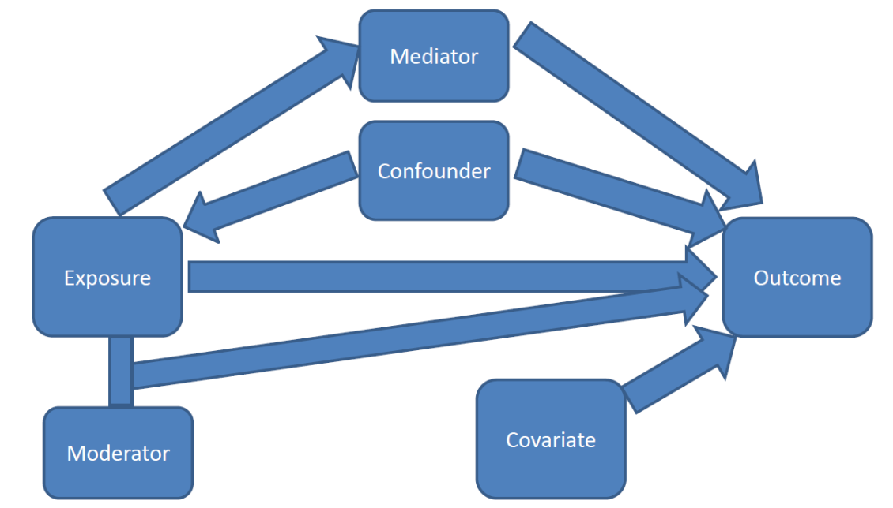

https://significantlystatistical.wordpress.com/2014/12/12/confounders-mediators-moderators-and-covariates/

Step 1:  Determine what statistically significant relationships you want to test to see if a Third Variable or variables are confounds, or if significantly related to the Predictor Variable (i.e., Explanatory) and Criterion Variable (i.e., Response), therefore, increasing your ability to predict a future participants response.
 
Step 1a: Determine for each relationship if you need to do a Multiple Regression or Logistic Regression.
* If you have a “Strongly Agree” to “Strongly Disagree” variable that you have kept all 5 levels, you can treat it as a Quantitative Variable.
* Multiple Regression - Predictor/Explanatory Variable is Categorical (binary, only two levels) or Quantitative & Response Variable is Quantitative, Third Variables are Categorical (binary, only two levels).
* C  Q look to ANOVA assignment (will need to collapse C into 2 levels)
* Q  Q look to correlation assignment
* Logistic Regression - Explanatory Variable is Categorical (binary, only two levels) or Quantitative & Response is Categorical (binary, only two levels), Third Variables are Categorical (binary, only two levels).
* C  C look to chi-square assignment 

(NOTE: You are required to do TWO regressions. I would prefer it to be 1 Multiple and 1 Logistic. However, if you do not have quantitative response variables you will not be able to do the Multiple Regression. You will need to state this at the top of your paper.)
 
Step 2: Determine the third variable (or confounder) you want to test in each of these relationships. You may use the same third variable in each analysis if it makes sense. Also, your third variables must be CATEGORICAL and contain ONLY TWO LEVELS.
* Consider the relationship and ask yourself if I had to predict a future persons response based on the Predictor/Explanatory variable and some other variable or variables what would they be? Use those if they are variables in the AddHealth codebook. 
* Below is the code for collapsing a categorical variable into two levels. 
* H1DA5 = "During the past week, how many times did you play an active sport?" The response options are “not at all” (0), “1 or 2 times” (1), “3 or 4 times” (2), and “5 or more times” (3)
o	We would combine the “0” and “1” responses into one group and the “2” and “3” response options into another group using the code below. 
	Note: The two lines of SAS code would go below your missing data code.
	You should also add this new variable (Sport) to your label code. 
IF H1DA5 LE 1 then Sport=0;
ELSE IF H1DA5 GE 2 then Sport=1;

Step 2b: Write out your Research Question, Null, and Alternative Hypothesis for both analyses you intend to run to determine if the Third Variable is a Confound or not. 
•	These will be written the same except include the phrasing of “after controlling for ‘Third Variable’.”

Step 3 is for Multiple Regression & Step 4 is for Logistic Regression

Step 3a: Multiple Regression
•	If you are using an association from your old ANOVA lab here, change your categorical variable that you are using as an explanatory variable down to two levels. You want those two levels to be essentially yes = 0 and no = 1.
o	Example if using a “strongly agree” to “strongly disagree” variable - decide if you want to compare those that “strongly agreed” on question to all those people that did not or if you want to compare those that “strongly disagreed” on question to all those people that did not. Then recode the original variable so that those that are “strongly agree” are dummy coded to 0 (i.e., yes to the statement) and all other levels are dummy coded to 1 (i.e., no to the statement).
o	When you recode the original variable, you want to make it easiest on you for interpreting the results. Therefore, for this assignment for MULTIPLE REGRESSION you MUST recode so the yes = 0 and no = 1. You CANNOT use any other dummy codes to represent a category with multiple regression. Recoding this way ensures you are predicting the presence of your categorical variable and not the absence of it. 
•	You do not have to test more than 1 third variable. One is sufficient. 

/*analyzing association b/ predictor & response*/
Proc glm; model QuantitativeResponse=ExplanatoryVariable /solution; 

/*analyzing see if third variable 1 is confound or significantly associated with predictor & response*/
Proc glm; model QuantitativeResponse=ExplanatoryVariable CategoricalThirdVariable1 /solution; 

/*OPTIONAL analyzing see if third variable 2 is a confound or significantly associated with predictor & response (note: should add third variables one at a time to determine their effects, then add second, and so on so you can see what each does as you add it to existing code)*/
Proc glm; model QuantitativeResponse=ExplanatoryVariable CategoricalThirdVariable1 CategoricalThirdVariable2 /solution;

Step 3b: Interpreting Multiple Regression 
•	Look at the first set of results. The relationship between Predictor/Explanatory and Response should be significant in the “parameter estimates” table (the last table in the results). If so, then can test third variables to see if a confound or predictor. 
o	You can look at R2 to see how much of Response you are accounting for with Predictor (second table).
•	Look at the second set of results. When third variable is included in the code, look at p-value for explanatory variable. One of two things will have happened.  
o	1 - If it is still significant, the third variable is NOT a confound because after controlling for the effects of the third variable from the relationship between the Predictor/Explanatory and Response it is still significant. When control for it, you are essentially putting everyone on the same level regarding that third variable. Look at R2 to see how much of Response you are accounting for with Predictor and Third Variable to see if you improved your prediction.
o	2 - If the p-value for explanatory variable is no longer significant, then the third variable is a confounding variable.  This means that the third variable is explaining the relationship between the explanatory variable and the response variable.
•	OPTIONAL - If you have more than one third variable you want to test, can include it next, then determine if it is a confound or not. 
o	Determine this by seeing if scenario 1 or 2 from above occurred. 
o	If it is not a confound, look at R2 to see how much of Response you are accounting for with two Predictor Variables (i.e., both Third Variables) to see if you improved your prediction. You want to pick the model that has significant relationships and accounts for the most amount of the Response.

Step 3c: Writing results for Multiple Regression

Sample Outline: 
(Replace the italicized and bold words with your own variable and data)

After adjusting for the potential confounding factor of third variable, explanatory variable (Beta = parameter estimate, p = significance value) was significantly/not significantly and positively/negatively associated with response variable. Approximately R-Square*100 of the variance of response can be accounted for by explanatory after controlling for third variable. Based on these analyses, third variable is not/is a confounding factor because the association between explanatory and response is still/is no longer significant after accounting for third variable. 

Scenario 1 Completed Sample for NO CONFOUND (#1):
After adjusting for the potential confounding factor of gender, number of times an adolescent has skipped school (Beta = -0.021, p = .0001) was significantly and negatively associated with GPA. Approximately 6.58% of the variance in GPA can be accounted for by skipping school after controlling for gender. Based on these analyses, gender is not a confounding factor because the association between skipping school and GPA is still significant after accounting for gender. 

Scenario 2 Completed Sample for CONFOUND (#2):
After adjusting for the potential confounding factor of gender, an adolescent’s weight (Beta = 134.0, p = .1558) was not significantly associated with the number of cigarettes smoked in the past 30 days. Approximately 0.78% of the variance in cigarettes smoked can be accounted for by weight after controlling for gender. Based on these analyses, gender is a confounding factor because the association between weight and cigarettes smoked is no longer significant after accounting for gender. 

Step 4a: Logistic Regression
•	Change your categorical variables that you are using as explanatory, response, and third variables down to two levels, but you want those two levels to be yes = 1 and no = 2.
o	I know this does not seem like a big change, except increasing the dummy code by one value, but it allows you to interpret your odds ratio. Just slightly change the name of the categorical variable to include in the logistic regression if you already recoded it for multiple regression.
o	For example, the sex variable is bio_sex with 1 = male and 2 = female, so you can leave this alone because it is either one or the other with no other options.
o	Example if using a “strongly agree” to “strongly disagree” variable - decide if you want to compare those that “strongly agreed” on question to all those people that did not or if you want to compare those that “strongly disagreed” on question to all those people that did not. Then recode the original variable so that those that are “strongly agree” are dummy coded to 1 (i.e., yes to the statement) and all other levels are dummy coded to 2 (i.e., no to the statement).
o	When you recode the original variable, you want to make it easiest on you for completing the SAS code and interpreting the results. Therefore, for this assignment for LOGISTIC REGRESSION you MUST recode so the yes = 1 and no = 2. You CANNOT use any other dummy codes to represent a category with logistic regression. Recoding this way ensures you are predicting the presence of your categorical variable and not the absence of it. 
•	You do not have to test more than 1 third variable. One is sufficient. 
/*analyzing association b/ predictor & response*/
Proc logistic; class CategoricalExplanatoryVariable;
model CategoricalResponse=ExplanatoryVariable; 

/*analyzing see if third variable 1 is confound or significantly associated with predictor & response*/
Proc logistic; class CategoricalExplanatoryVariable CatThirdVariable1;
model CategoricalResponse=ExplanatoryVariable CatThirdVariable1; 

/*OPTIONAL analyzing see if third variable 2 is a confound or significantly associated with predictor & response (note: should add third variables one at a time to determine their effects, then add second, and so on so you can see what each does as you add it to existing code)*/
Proc logistic; class CategoricalExplanatoryVariable CatThirdVariable1 CatThirdVariable2;
model CategoricalResponse=ExplanatoryVariable CatThirdVariable1 CatThirdVariable2; 

Step 4b: Interpretation Logistic Regression
•	Look to the first set of results. The relationship between the explanatory and response variable should be significant in the “analysis of maximum likelihood” table (9th table down). If so, then you can test third variables to see if they are confounds or predictors. There is no R2 here. 
•	Now look to the second set of results. When the third variable is included in the code, look at the p-value for the explanatory variable. If it is still significant, the third variable is not a confounding variable. 
o	In other words, after controlling for the effects of the third variable on the relationship between the explanatory and response variable, the relationship is still significant. When you control for a variable, you are essentially putting everyone on the same level regarding that variable. 
•	Next, look at the “odds ratio estimates” table (10th table down). Remember you must have recoded your variables correctly for logistic regression to be able to interpret this. You will see one of three things: 
o	OR estimate = 1 = equal chance of response variable being YES given any explanatory variable value. You are not able to predict participants’ responses by knowing their explanatory variable value. This would be a nonsignificant model when looking at the p-value for the explanatory variable in the parameter estimate table.
o	OR estimate greater than 1 = as the explanatory variable value increases, the presence of a YES response is more likely. We can say that when a participant’s response to the explanatory variable is YES (1), they are more likely to have a response that is a YES (1). 
o	OR estimate less than 1 = as the explanatory variable value increases, the presence of a YES response is less likely. We can say that when a participant’s response to the explanatory variable is YES (1) they are less likely to have a response that is a YES (1). 
•	Confidence intervals are a range for the population’s predicted odds ratio based on the sample data. We are 95% confident that any given population’s odds ratio would range between those two values. When the confidence intervals do not overlap for the explanatory variables and third variables, the variable with the higher values we would say is more strongly associated with our response variable.
•	For both the odds ratio and confidence interval interpretation, when you add in third variables it is explained in the same way except that you are controlling for the third variable or explanatory variable.
•	When you add a third variable to the logistic regression, if you determine one is a confound then you do not interpret the variable that becomes nonsignificant in the odds ratio.

Step 4c: Writing results for Logistic Regression

Sample Outline: 
(Replace the italicized and bold words with your own variable and data)

After adjusting for the potential confounding factor of third variable, explanatory variable (OR odds ratio estimate, CI confidence interval range, p = significance value) was significantly/not significantly and positively/negatively associated with the likelihood of response variable. In this analysis, the odds ratio tells us that those who are [describe what dummy code 1 of your explanatory variable means here] are odds ratio estimate times more (if OR greater than 1)/less (if OR less than 1) likely to [describe what dummy code 1 of your response variable means here].  Based on these analyses, third variable is not/is a confounding factor because the association between explanatory and response is still/is no longer significant after accounting for third variable. 

Completed Sample for CONFOUND:
After adjusting for the potential confounding factor of gender, being overweight (OR 0.920, CI 0.822 – 1.028, p = .1420) was not significantly associated with the likelihood of participating in an active sport. In this analysis, the odds ratio tells us that those adolescents who are overweight are 0.920 times less likely to participate in an active sport. Based on these analyses, gender is a confounding factor because the association between being overweight and active sport participation is no longer significant after accounting for gender.

Completed Sample for NO CONFOUND:
After adjusting for the potential confounding factor of gender, being overweight (OR 3.65, CI 1.573 – 4.891, p = .0001) was significantly and positively associated with the likelihood of participating in an active sport. In this analysis, the odds ratio tells us that those adolescents who are overweight are 3.65 times more likely to participate in an active sport. Based on these analyses, gender is not a confounding factor because the association between being overweight and active sport participation is still significant after accounting for gender. 
 

