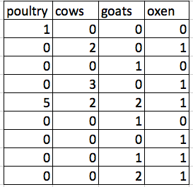

_Last Updated: `r format(Sys.time(), "%a %b %d %X")` _   
 

# Setup

* Humans use spreadsheets differently than computers
* What do you want to do with the data is important to consider during setup
* You can set things up in different ways in spreadsheets, but some of these choices can limit your ability to work with the data in other programs 

#### Questions (Answer in HackMD collab notes)

1. What kind of tasks do you do in spreadsheets?
2. Which tasks do you think spreadsheets are good for?
3. Spreadsheet frustrations (Pain points) _(What have you accidentally done that made you frustrated or sad)_

# Good Practices 

* Put all variables in columns - this is the thing that you're measuring (weight, temp, address)
* One observation per row
* Don't combine multiple pieces of information in once cell. 
* pct_5_10_F : percent of females between 5 & 10 years old in that county
* **Leave raw data alone**
* Export the cleaned data to a text based format like CSV (comma separated values)
* Leave missing data cells blank:
    *  don't put a `.`, or `missing`, or 0, or NULL

# Example - livestock data

Consider a study of agricultural practices among farmers in two countries in eastern sub-Saharan Africa (Mozambique and Tanzania). Researchers conducted interviews with farmers in these countries to collect data on household statistics (e.g. number of household members, number of meals eaten per day, availability of water), farming practices (e.g. water usage), and assets (e.g. number of farm plots, number of livestock). They also recorded the dates and locations of each interview.

If they were to keep track of the data like this:

#### Questions (Answer in HackMD collab notes)

1. What are some of the problems with this?
2. What would this data look like in a _tidy_ data format?

> See [here](https://datacarpentry.org/spreadsheets-socialsci/fig/multiple-info.png) for the solution. 

<!---

--->

# Metadata 

* Recording data about your data ("metadata"") is essential. 
* **Think about yourself**. You may know now, but the chances that you will still remember the exact wording of the question you asked about your informants’ water use (the data recorded in the column water use), for example, are slim.
* **Think about others.** Other people may want to examine or use your data - to understand your findings, to verify your findings, to review your submitted publication, to replicate your results, to design a similar study, or even to archive your data for access and re-use by others.   
* Should not be contained in the data file itself. 
* Made for humans, not computers. 
* Often called _codebooks_ or _data dictionaries_ 

## Codebooks contain the following information

- variable name (for the computer)
- variable label (for the human)
- the prompt (e.g. survey text question)
- plausible values
- categorical value labels (e.g. 1: Chico, 2: Paradise)
    
    

[^dc]: Lesson adapted from https://datacarpentry.org/spreadsheets-socialsci/01-format-data/index.html 

# <a href="https://norcalbiostat.github.io/MATH615/"><button type="button">Back</button> </a>

